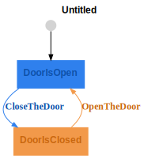

<picture>
  <source media="(prefers-color-scheme: dark)" srcset="assets/logo-dark.png">
  <source media="(prefers-color-scheme: light)" srcset="assets/logo-light.png">
  
</picture>

Type-Safe State Machines.

<!-- START doctoc generated TOC please keep comment here to allow auto update -->
<!-- DON'T EDIT THIS SECTION, INSTEAD RE-RUN doctoc TO UPDATE -->

- [Transit](#transit)
  - [Installation](#installation)
  - [A](#a)

<!-- END doctoc generated TOC please keep comment here to allow auto update -->

# Transit

## Installation

```bash
spago install transit
```

## A




<!-- PD_START:purs
filePath: test/Test/Examples/Door.purs
pick:
  - State
  - Msg
-->

```purescript
data State
  = DoorOpen
  | DoorClosed

data Msg = Close | Open
```

<!-- PD_END -->

<!-- PD_START:purs
filePath: test/Test/Examples/Door.purs
pick:
  - updateClassic
-->

```purescript
updateClassic :: State -> Msg -> State
updateClassic state msg = case state, msg of
  DoorOpen, Close -> DoorClosed
  DoorClosed, Open -> DoorOpen
  _, _ -> state
```

<!-- PD_END -->

---


```purescript


type Temperature = Number
type WaterLevel = Number

data State
  = Idle
  | Heating { targetTemp :: Temperature }
  | Ready   { waterLevel :: WaterLevel, temp :: Temperature }
  | Brewing { seconds :: Int }
  | Error { message :: String }
  | Done


data Msg
  = PowerOn { targetTemp :: Temperature }
  | TempReached { temp :: Temperature }
  | StartBrew { pumpOK :: Boolean, waterLevel :: WaterLevel }
  | BrewTick { deltaSeconds :: Int }   -- <— new
  | BrewComplete
  | SensorErrorDetected { message :: String }
  | RefillDone { waterAdded :: WaterLevel }
  | PowerOff
  | Reset


```
