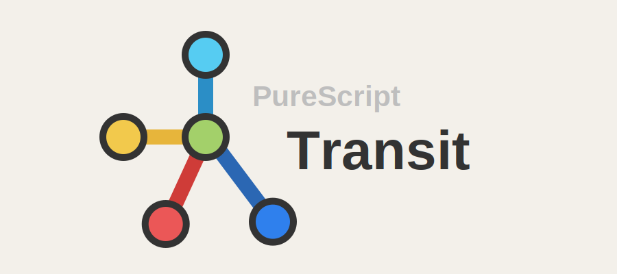
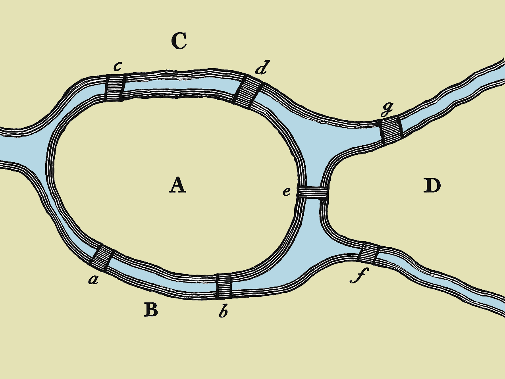
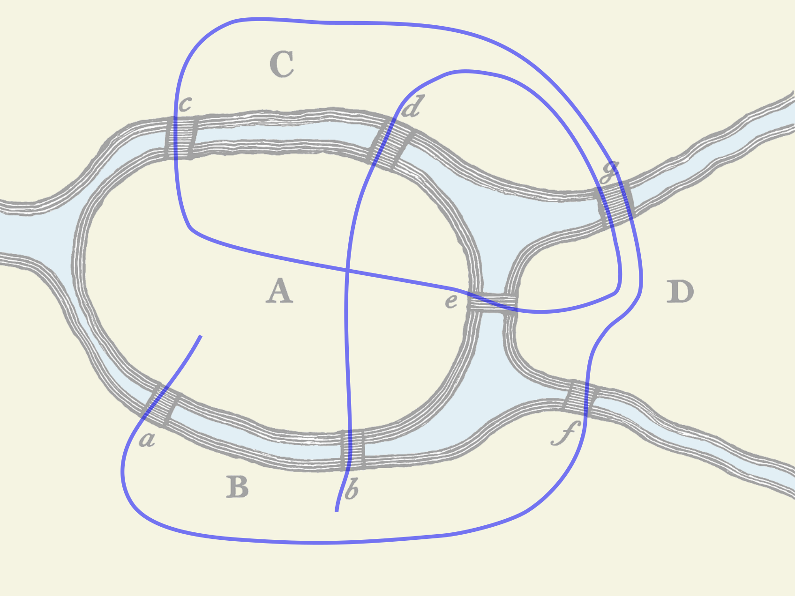
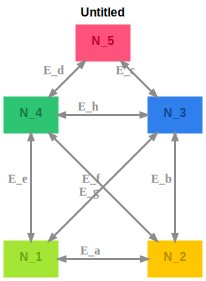
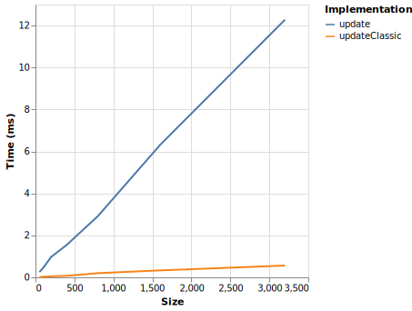
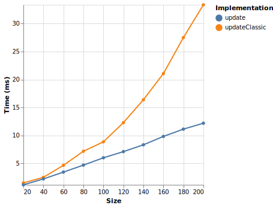

<picture>
  <source media="(prefers-color-scheme: dark)" srcset="assets/logo-dark.svg">
  <source media="(prefers-color-scheme: light)" srcset="assets/logo-light.svg">
  
</picture>

<!-- START doctoc generated TOC please keep comment here to allow auto update -->
<!-- DON'T EDIT THIS SECTION, INSTEAD RE-RUN doctoc TO UPDATE -->

- [Transit - Type-Safe State Machines](#transit---type-safe-state-machines)
  - [Introduction](#introduction)
    - [Key Features](#key-features)
    - [About This Documentation](#about-this-documentation)
    - [Installation](#installation)
  - [Example 1: A Simple Door](#example-1-a-simple-door)
    - [The State Machine](#the-state-machine)
    - [State Machine Implementation I: The Classic Approach](#state-machine-implementation-i-the-classic-approach)
    - [State Machine Implementation II: The Transit Approach](#state-machine-implementation-ii-the-transit-approach)
    - [Writing Tests for the update function](#writing-tests-for-the-update-function)
    - [Generating Diagrams and Tables](#generating-diagrams-and-tables)
    - [Conclusion](#conclusion)
  - [Example 2: Door with Pin](#example-2-door-with-pin)
    - [State machine implementation I: The Classic Approach](#state-machine-implementation-i-the-classic-approach)
    - [State machine implementation II: The Transit Approach](#state-machine-implementation-ii-the-transit-approach)
    - [Type signatures](#type-signatures)
  - [Example 3: Seven Bridges of Königsberg](#example-3-seven-bridges-of-k%C3%B6nigsberg)
    - [Graph Analysis](#graph-analysis)
  - [Example 4: The house of Santa Claus](#example-4-the-house-of-santa-claus)
  - [Benchmarks](#benchmarks)
  - [More](#more)
    - [Monadic update functions](#monadic-update-functions)
    - [Error handling](#error-handling)

<!-- END doctoc generated TOC please keep comment here to allow auto update -->

# Transit - Type-Safe State Machines

**Transit** is a PureScript library for building type-safe state machines. It provides a type-level DSL for specifying state transitions. You define your state machine once using this specification, and the compiler ensures your implementation matches it—eliminating bugs from invalid transitions, missing cases, or documentation drift.

## Introduction

### Key Features

- **Type-safe state transitions** - The compiler ensures all transitions are valid and complete
- **Automatic diagram generation** - Generate state diagrams and transition tables directly from your specification
- **Graph analysis** - Convert your state machine into a graph data structure for advanced analysis

> If you're familiar with Servant[^servant] from Haskell, **Transit** follows a similar philosophy: just as Servant uses a REST API type-level specification to ensure type-safe routing functions and generate OpenAPI documentation, **Transit** uses a state machine graph type-level specification to ensure type-safe update functions and generate state diagrams.

### About This Documentation

All code examples in this documentation are extracted from actual, type-checked PureScript source files. Also, whenever you find an assertion or a full unit test, it's ensured that it ran and passed. In this sense this text is not just documentation, but also a test suite. At the bottom of every code example you can find a link to the actual source file. So you can get a better picture of the context and get information about the imports used.

### Installation

Transit is published to Pursuit[^pursuit]. You can install it with `spago`:

```bash
spago install transit
```

## Example 1: A Simple Door

> Full source code: _[test/Examples/SimpleDoor.purs](test/Examples/SimpleDoor.purs)_

Let's start with a simple door state machine to demonstrate **Transit**'s core concepts. This example will show you how to define a state machine using **Transit**'s type-level DSL, implement a type-safe update function, and generate documentation automatically. We'll compare the traditional approach with **Transit**'s approach to highlight the benefits of the latter.

### The State Machine

Think of a door that can be either open or closed. When it's open, you can close it. When it's closed, you can open it. That's it—no other actions make sense. You can't open a door that's already open, and you can't close a door that's already closed. This simple behavior is what we're modeling here.

Before diving into the code, let's visualize our simple door state machine. This will help you understand the structure we're about to implement.

#### State Diagram

The state diagram below shows all possible states and the valid transitions between them:

<picture>
  <source media="(prefers-color-scheme: dark)" srcset="graphs/simple-door-dark.svg">
  <source media="(prefers-color-scheme: light)" srcset="graphs/simple-door-light.svg">
  
</picture>

In this diagram, you can see:

- **Two states**: `DoorOpen` and `DoorClosed` (shown as rectangles)
- **Two transitions**: The `Close` transition moves from `DoorOpen` to `DoorClosed`, and the `Open` transition moves from `DoorClosed` to `DoorOpen`
- **Arrows**: The direction of each arrow shows which state changes are valid

#### Transition Table

For a more structured view, here's the corresponding transition table:

<!-- PD_START:raw
filePath: graphs/simple-door.html
wrapNl: true
-->
<table><thead><tr><th>State</th><th></th><th>Message</th><th></th><th>State</th></tr></thead><tbody><tr><td>DoorOpen</td><td>⟶</td><td>Close</td><td>⟶</td><td>DoorClosed</td></tr></tbody><tbody><tr><td>DoorClosed</td><td>⟶</td><td>Open</td><td>⟶</td><td>DoorOpen</td></tr></tbody></table>
<!-- PD_END -->

Each row shows one valid transition: which state you start in, which action you take, and which state you end up in. Notice that invalid actions—like trying to open an already open door—simply don't appear in the table.

Now let's see how we represent this in PureScript code.

### State Machine Implementation I: The Classic Approach

Before diving into **Transit**, let's first look at how state machines are typically implemented in PureScript using pattern matching. This classic approach is familiar to most PureScript developers and serves as a baseline for understanding what **Transit** improves upon.

#### States and Message types

To represent our door in code, we need two major types: the states the door can be in, and the actions that can change those states. In PureScript, we define these as simple data types. We are using the suffix `D` to denote the traditional approach (D = data).

<!-- PD_START:purs
filePath: test/Examples/SimpleDoor.purs
pick:
  - StateD
  - MsgD
-->

```purescript
data StateD = DoorOpen | DoorClosed

data MsgD = Close | Open
```

<p align="right"><sup>🗎 <a href="test/Examples/SimpleDoor.purs#L28-L30">test/Examples/SimpleDoor.purs L28-L30</a></sup></p>
<!-- PD_END -->

The `State` type captures the two possible states we saw in the diagram: `DoorOpen` and `DoorClosed`. The `Msg` type represents the two actions: `Close` and `Open`. These correspond directly to what we visualized earlier—each state and each transition from the diagram has a corresponding value in these types.

#### The update function

Now that we have our types, we need a function that takes the current state and a message, and returns the new state. The traditional way to implement this is with a pattern-matching function:

<!-- PD_START:purs
filePath: test/Examples/SimpleDoor.purs
pick:
  - updateD
-->

```purescript
updateD :: StateD -> MsgD -> StateD
updateD state msg = case state, msg of
  DoorOpen, Close -> DoorClosed
  DoorClosed, Open -> DoorOpen
  _, _ -> state
```

<p align="right"><sup>🗎 <a href="test/Examples/SimpleDoor.purs#L36-L40">test/Examples/SimpleDoor.purs L36-L40</a></sup></p>
<!-- PD_END -->

This function handles the two valid transitions we saw in the diagram: closing an open door and opening a closed door. The catch-all case `_, _ -> state` handles any invalid combinations (like trying to open an already open door) by returning the current state unchanged.

While this approach works and is straightforward, it has some drawbacks:

- **No compile-time safety**: The compiler won't catch if you forget to handle a valid transition or if you add a new state but forget to update the function
- **Documentation drift**: If you update the state diagram, there's nothing ensuring the code stays in sync—you have to remember to update both manually

### State Machine Implementation II: The Transit Approach

With the **Transit** library, we take a different approach that addresses the drawbacks of the classic method. Instead of writing the update function directly, we first define a type-level specification that describes our state machine. This specification serves as a single source of truth that the compiler can verify against your implementation.

#### The Type-Level Specification

First, we define the state machine structure using **Transit**'s type-level DSL:

<!-- PD_START:purs
filePath: test/Examples/SimpleDoor.purs
pick:
  - SimpleDoorTransit
-->

```purescript
type SimpleDoorTransit =
  Empty
    :* ("DoorOpen" :@ "Close" >| "DoorClosed")
    :* ("DoorClosed" :@ "Open" >| "DoorOpen")
```

<p align="right"><sup>🗎 <a href="test/Examples/SimpleDoor.purs#L56-L59">test/Examples/SimpleDoor.purs L56-L59</a></sup></p>
<!-- PD_END -->

Breaking down the syntax:

- `Empty` initializes an empty transition list
- `:*` is an infix operator that appends each transition to the list
- `"DoorOpen" :@ "Close" >| "DoorClosed"` means: in state `DoorOpen`, when receiving message `Close`, transition to state `DoorClosed`
- The `@` operator connects a state to a message, and `>|` indicates the target state

This type-level specification fully defines the state machine's structure. The compiler can now use this specification to ensure our implementation is correct.

#### State and Message Types

**Transit** uses `Variant` types (from `purescript-variant`)[^variant] for both `State` and `Msg` instead of traditional ADTs. Variants are open sum types where each constructor is labeled with a type-level symbol (like `"DoorOpen"` or `"Close"`).

This design choice is crucial for **Transit**'s type-level machinery. The key advantage is that **Transit** can filter the possible cases (both input states/messages and output states) for each handler function. Variants are perfect for this. There is no way to express a subset of cases from a traditional ADT.

<!-- PD_START:purs
filePath: test/Examples/SimpleDoor.purs
pick:
  - State
  - Msg
-->

```purescript
type State = Variant
  ( "DoorOpen" :: {}
  , "DoorClosed" :: {}
  )

type Msg = Variant
  ( "Close" :: {}
  , "Open" :: {}
  )
```

<p align="right"><sup>🗎 <a href="test/Examples/SimpleDoor.purs#L46-L54">test/Examples/SimpleDoor.purs L46-L54</a></sup></p>
<!-- PD_END -->

#### The Update Function

Based on this specification, we create an update function using `mkUpdate`:

<!-- PD_START:purs
filePath: test/Examples/SimpleDoor.purs
pick:
  - update
-->

```purescript
update :: State -> Msg -> State
update = mkUpdate @SimpleDoorTransit
  (match @"DoorOpen" @"Close" \_ _ -> return @"DoorClosed")
  (match @"DoorClosed" @"Open" \_ _ -> return @"DoorOpen")
```

<p align="right"><sup>🗎 <a href="test/Examples/SimpleDoor.purs#L61-L64">test/Examples/SimpleDoor.purs L61-L64</a></sup></p>
<!-- PD_END -->

Here's how this works:

- `mkUpdate @SimpleDoorTransit` creates an update function based on the `SimpleDoorTransit` specification. The `@` symbol is type application[^type-app], passing the specification to the function.
- Each `match` line handles one transition from the specification. The first two arguments (`@"DoorOpen"` and `@"Close"`) are type-level symbols (type applications) that specify which state and message to match on. The lambda function defines what happens when that transition occurs.
- `return @"DoorClosed"` specifies which state to transition to. The `return` function is part of **Transit**'s DSL for specifying the target state, and the `@` symbol again indicates a type-level symbol.

#### How This Solves the Classic Approach's Problems

This approach addresses all the drawbacks we saw earlier:

- **Compile-time safety**: The compiler verifies that your `match` lines exactly correspond to the specification. Every transition in the spec must have a corresponding `match` line, and you can't add extra matches that aren't in the spec. If you miss a transition or add an invalid one, the code won't compile.
- **No documentation drift**: The specification is the source of truth. If you change the spec, the compiler forces you to update the implementation to match, ensuring code and specification stay in sync.

### Writing Tests for the update function

#### Creating Variant Values

To create values of type `Variant`, **Transit** provides the `v` function from `Transit.VariantUtils`. It's a convenience wrapper around `Variant`'s `inj` function that uses type application (no Proxy needed) and allows omitting empty record arguments:

- Empty record payload (argument can be omitted)

  ```purescript
  v @"DoorOpen" :: State
  ```

- Non-empty payload (must provide the data)
  ```purescript
  v @"DoorLocked" { activePin: "1234" } :: State
  ```

This is more ergonomic than using `V.inj (Proxy :: _ "DoorOpen") {}` directly.

#### Testing State Transitions

To test our update function, we'll use two useful functions from the `Data.Array` module:

<!-- PD_START:purs
inline: true
pick:
  - tag: signature_or_foreign
    name: foldl
    filePath: .spago/p/arrays-7.3.0/src/Data/Array.purs
    prefix: '- '
  - tag: signature_or_foreign
    name: scanl
    filePath: .spago/p/arrays-7.3.0/src/Data/Array.purs
    prefix: '- '
split: true
-->

- `foldl :: forall a b. (b -> a -> b) -> b -> Array a -> b`
- `scanl :: forall a b. (b -> a -> b) -> b -> Array a -> Array b`

<!-- PD_END -->

The simplest way to test the update function is to use `foldl` to apply a sequence of messages and check if the final state matches what we expect:

<!-- PD_START:purs
filePath: test/Examples/SimpleDoor.purs
pick:
  - tag: value
    name: assert1
-->

```purescript
assert1 =
  foldl update (v @"DoorOpen") [ v @"Close", v @"Open", v @"Close" ]
    `shouldEqual`
      (v @"DoorClosed")
```

<p align="right"><sup>🗎 <a href="test/Examples/SimpleDoor.purs#L71-L74">test/Examples/SimpleDoor.purs L71-L74</a></sup></p>
<!-- PD_END -->

This test starts with the door open, closes it, opens it, then closes it again. It checks that we end up with the door closed, as expected.

This test only checks the final result. To be more thorough, we should also verify that each step along the way works correctly. The `scanl` function is perfect for this—it shows us all the intermediate states, not just the final one.

<!-- PD_START:purs
filePath: test/Examples/SimpleDoor.purs
pick:
  - tag: value
    name: assert2
-->

```purescript
assert2 =
  scanl update (v @"DoorOpen") [ v @"Close", v @"Open", v @"Close" ]
    `shouldEqual`
      [ v @"DoorClosed", v @"DoorOpen", v @"DoorClosed" ]
```

<p align="right"><sup>🗎 <a href="test/Examples/SimpleDoor.purs#L77-L80">test/Examples/SimpleDoor.purs L77-L80</a></sup></p>
<!-- PD_END -->

This test does the same thing—starts with the door open, closes it, opens it, then closes it again. But instead of just checking the final result, it verifies each step along the way: after closing, the door is closed; after opening, the door is open; and after closing again, the door is closed. This makes sure each transition works correctly.

Since we'll want to write more of these tests for further examples, it's helpful to define a reusable helper function. The `assertWalk` function takes an update function, an initial state, and a list of message/state pairs representing the expected walk through the state machine:

<!-- PD_START:purs
filePath: test/Examples/Common.purs
pick:
  - assertWalk
-->

```purescript
assertWalk
  :: forall msg state
   . Eq state
  => Show state
  => (state -> msg -> state)
  -> state
  -> Array (msg /\ state)
  -> Aff Unit
assertWalk updateFn initState walk = do
  let
    msgs :: Array msg
    msgs = map fst walk

    expectedStates :: Array state
    expectedStates = map snd walk

    actualStates :: Array state
    actualStates = scanl updateFn initState msgs

  actualStates `shouldEqual` expectedStates
```

<p align="right"><sup>🗎 <a href="test/Examples/Common.purs#L35-L54">test/Examples/Common.purs L35-L54</a></sup></p>
<!-- PD_END -->

The function extracts the messages from the pairs, applies them sequentially using `scanl`, and verifies that the resulting states match the expected ones. Here's how we use it:

<!-- PD_START:purs
filePath: test/Examples/SimpleDoor.purs
pick:
  - tag: value
    name: assert3
-->

```purescript
assert3 =
  assertWalk update
    (v @"DoorOpen")
    [ v @"Close" ~> v @"DoorClosed"
    , v @"Open" ~> v @"DoorOpen"
    , v @"Close" ~> v @"DoorClosed"
    , v @"Close" ~> v @"DoorClosed"
    , v @"Open" ~> v @"DoorOpen"
    , v @"Open" ~> v @"DoorOpen"
    , v @"Open" ~> v @"DoorOpen"
    ]
```

<p align="right"><sup>🗎 <a href="test/Examples/SimpleDoor.purs#L83-L93">test/Examples/SimpleDoor.purs L83-L93</a></sup></p>
<!-- PD_END -->

### Generating Diagrams and Tables

**Transit** can generate both state diagrams and transition tables directly from your type-level specification. Both generation processes use the same approach: `reflectType` converts your type-level DSL specification to a term-level equivalent, which can then be used to generate the documentation.

#### State Diagrams

To generate a state diagram, you use `TransitGraphviz.writeToFile` to render a Graphviz `.dot` file:

<!-- PD_START:purs
filePath: src/Transit/Generators/Graphviz.purs
inline: true
pick:
  - tag: signature_or_foreign
    name: writeToFile
    prefix: '- '
split: true
-->

- `writeToFile :: FilePath -> TransitCore -> (Options -> Options) -> Effect Unit`

<p align="right"><sup>🗎 <a href="src/Transit/Generators/Graphviz.purs#L212-L212">src/Transit/Generators/Graphviz.purs L212-L212</a></sup></p>
<!-- PD_END -->

<!-- PD_START:purs
filePath: test/Examples/SimpleDoor.purs
pick:
  - generateStateDiagram
-->

```purescript
generateStateDiagram :: Effect Unit
generateStateDiagram = do
  let
    transit = reflectType (Proxy @SimpleDoorTransit)

  TransitGraphviz.writeToFile "graphs/simple-door-light.dot" transit _
    { theme = themeHarmonyLight
    }

  TransitGraphviz.writeToFile "graphs/simple-door-dark.dot" transit _
    { theme = themeHarmonyDark
    }
```

<p align="right"><sup>🗎 <a href="test/Examples/SimpleDoor.purs#L107-L118">test/Examples/SimpleDoor.purs L107-L118</a></sup></p>
<!-- PD_END -->

The process works in two steps:

1. `reflectType` converts your type-level DSL specification to a term-level equivalent
2. `TransitGraphviz.writeToFile` uses that to render a Graphviz `.dot` file

The `writeToFile` function accepts an options record that lets you customize the diagram. E.g. the `theme` option which we're using above controls the color scheme. **Transit** provides a couple of built-in themes. But you can also provide your own.

To convert the `.dot` file to an SVG (or other formats), use the Graphviz[^graphviz] command-line tools:

```bash
dot -Tsvg graphs/simple-door.dot -o graphs/simple-door.svg
```

Or for PNG:

```bash
dot -Tpng graphs/simple-door.dot -o graphs/simple-door.png
```

#### Transition Tables

In addition to state diagrams, you can also generate transition tables from the same specification. This provides a tabular view of all state transitions, which can be easier to read for some use cases.

The process is identical—you use `reflectType` to convert your DSL specification, but then use `TransitTable.writeToFile` instead:

<!-- PD_START:purs
filePath: test/Examples/SimpleDoor.purs
pick:
  - generateTransitionTable
-->

```purescript
generateTransitionTable :: Effect Unit
generateTransitionTable = do
  let
    transit = reflectType (Proxy @SimpleDoorTransit)

  TransitTable.writeToFile "graphs/simple-door.html" transit identity
```

<p align="right"><sup>🗎 <a href="test/Examples/SimpleDoor.purs#L120-L125">test/Examples/SimpleDoor.purs L120-L125</a></sup></p>
<!-- PD_END -->

This generates an HTML file containing a table with columns for "From State", "Message", and "To State".

Since both the state diagram and transition table are generated from the same DSL specification, they're guaranteed to be consistent with each other and with your type-level specification.

### Conclusion

In this example, we've seen how **Transit** helps you build type-safe state machines. We started with a simple door that can be open or closed, and learned the core workflow:

1. **Define the state machine** using **Transit**'s type-level DSL specification
2. **Implement the update function** using `mkUpdate` with `match` clauses that the compiler verifies against the specification
3. **Generate documentation** automatically—both state diagrams and transition tables—from the same specification

The key advantage is that your specification, implementation, and documentation all stay in sync because they share the same source of truth. The compiler ensures your code matches your specification, and your documentation is generated directly from it.

While this example was simple, it demonstrates **Transit**'s fundamental approach. In the next example, we'll see how **Transit** handles more complex scenarios with states that contain data and conditional transitions.

## Example 2: Door with Pin

> Full source code: _[test/Examples/DoorWithPin.purs](test/Examples/DoorWithPin.purs)_

Now let's extend our door to support PIN-based locking. In this enhanced version, you can lock the door with a PIN code, and then unlock it by entering the correct PIN. This introduces two important concepts: **states with data** and **conditional transitions**.

<picture>
  <source media="(prefers-color-scheme: dark)" srcset="graphs/door-with-pin-dark.svg">
  <source media="(prefers-color-scheme: light)" srcset="graphs/door-with-pin-light.svg">
  
</picture>

In this example, the `DoorLocked` state stores a PIN code, and the `Unlock` message includes the entered PIN. The unlock operation can succeed (transitioning to `DoorClosed`) or fail (staying in `DoorLocked`), depending on whether the entered PIN matches the stored one.

Notice the diamond node in the state diagram—this represents a conditional transition where the outcome depends on runtime data.

The transition table shows both possible outcomes:

<!-- PD_START:raw
filePath: graphs/door-with-pin.html
wrapNl: true
-->
<table><thead><tr><th>State</th><th></th><th>Message</th><th></th><th>Guard</th><th></th><th>State</th></tr></thead><tbody><tr><td>DoorOpen</td><td>⟶</td><td>Close</td><td></td><td></td><td>⟶</td><td>DoorClosed</td></tr></tbody><tbody><tr><td>DoorClosed</td><td>⟶</td><td>Open</td><td></td><td></td><td>⟶</td><td>DoorOpen</td></tr></tbody><tbody><tr><td>DoorClosed</td><td>⟶</td><td>Lock</td><td></td><td></td><td>⟶</td><td>DoorLocked</td></tr></tbody><tbody><tr><td>DoorLocked</td><td>⟶</td><td>Unlock</td><td>?</td><td>PinIncorrect</td><td>⟶</td><td>DoorLocked</td></tr></tbody><tbody><tr><td>DoorLocked</td><td>⟶</td><td>Unlock</td><td>?</td><td>PinCorrect</td><td>⟶</td><td>DoorClosed</td></tr></tbody></table>
<!-- PD_END -->

### State machine implementation I: The Classic Approach

#### States and Message types

The PureScript types now include data in both states and messages:

<!-- PD_START:purs
filePath: test/Examples/DoorWithPin.purs
pick:
  - StateD
  - MsgD
-->

```purescript
data StateD
  = DoorOpen
  | DoorClosed
  | DoorLocked { activePin :: String }

data MsgD
  = Close
  | Open
  | Lock { newPin :: String }
  | Unlock { enteredPin :: String }
```

<p align="right"><sup>🗎 <a href="test/Examples/DoorWithPin.purs#L33-L42">test/Examples/DoorWithPin.purs L33-L42</a></sup></p>
<!-- PD_END -->

#### The update function

The classic update function now needs to handle state and message data:

<!-- PD_START:purs
filePath: test/Examples/DoorWithPin.purs
pick:
  - updateClassic
-->

```purescript
updateClassic :: StateD -> MsgD -> StateD
updateClassic state msg = case state, msg of
  DoorOpen, Close -> DoorClosed
  DoorClosed, Open -> DoorOpen
  DoorClosed, Lock { newPin } -> DoorLocked { activePin: newPin }
  DoorLocked { activePin }, Unlock { enteredPin } ->
    if activePin == enteredPin then
      DoorClosed
    else
      DoorLocked { activePin }
  _, _ -> state
```

<p align="right"><sup>🗎 <a href="test/Examples/DoorWithPin.purs#L44-L54">test/Examples/DoorWithPin.purs L44-L54</a></sup></p>
<!-- PD_END -->

### State machine implementation II: The Transit Approach

In the DSL specification, we express conditional transitions by listing multiple possible target states:

<!-- PD_START:purs
filePath: test/Examples/DoorWithPin.purs
pick:
  - State
  - Msg
-->

```purescript
type State = Variant
  ( "DoorOpen" :: {}
  , "DoorClosed" :: {}
  , "DoorLocked" :: { activePin :: String }
  )

type Msg = Variant
  ( "Close" :: {}
  , "Open" :: {}
  , "Lock" :: { newPin :: String }
  , "Unlock" :: { enteredPin :: String }
  )
```

<p align="right"><sup>🗎 <a href="test/Examples/DoorWithPin.purs#L60-L71">test/Examples/DoorWithPin.purs L60-L71</a></sup></p>
<!-- PD_END -->

<!-- PD_START:purs
filePath: test/Examples/DoorWithPin.purs
pick:
  - DoorWithPinTransit
-->

```purescript
type DoorWithPinTransit =
  Empty
    :* ("DoorOpen" :@ "Close" >| "DoorClosed")
    :* ("DoorClosed" :@ "Open" >| "DoorOpen")
    :* ("DoorClosed" :@ "Lock" >| "DoorLocked")
    :*
      ( "DoorLocked" :@ "Unlock"
          >| ("PinCorrect" :? "DoorClosed")
          >| ("PinIncorrect" :? "DoorLocked")
      )
```

<p align="right"><sup>🗎 <a href="test/Examples/DoorWithPin.purs#L73-L82">test/Examples/DoorWithPin.purs L73-L82</a></sup></p>
<!-- PD_END -->

The syntax `("PinCorrect" :? "DoorClosed") >| ("PinIncorrect" :? "DoorLocked")` indicates that the `Unlock` message from `DoorLocked` can transition to either state, depending on runtime conditions. The `:?` operator associates a condition label (like `"PinCorrect"`) with a target state, and `>|` chains multiple conditional outcomes together.

The update function now has access to both the current state and the message data, allowing you to implement the conditional logic:

<!-- PD_START:purs
filePath: test/Examples/DoorWithPin.purs
pick:
  - update
-->

```purescript
update :: State -> Msg -> State
update = mkUpdate @DoorWithPinTransit
  ( match' @"DoorOpen" @"Close" \{} ->
      return @"DoorClosed"
  )
  ( match' @"DoorClosed" @"Open" \_ ->
      return @"DoorOpen"
  )
  ( match' @"DoorClosed" @"Lock" \{ msg } ->
      return @"DoorLocked" { activePin: msg.newPin }
  )
  ( match' @"DoorLocked" @"Unlock" \{ state, msg } ->
      if state.activePin == msg.enteredPin then
        returnVia @"PinCorrect" @"DoorClosed"
      else
        returnVia @"PinIncorrect" @"DoorLocked" { activePin: state.activePin }
  )
```

<p align="right"><sup>🗎 <a href="test/Examples/DoorWithPin.purs#L84-L100">test/Examples/DoorWithPin.purs L84-L100</a></sup></p>
<!-- PD_END -->

The match handlers receive both the current state and the message, giving you access to all the data needed to make runtime decisions. The type system still ensures that:

- 🔴 You can only return states that are valid targets for that transition
- 🔴 You handle all required transitions
- 🟢 The conditional logic is type-safe

### Type signatures

Understanding the type signatures that **Transit** enforces helps clarify how the type system ensures correctness. This section demonstrates the exact types that each match handler must satisfy, showing how **Transit** uses `Variant` types to represent subsets of possible states.

> Full source code: _[test/Examples/Signatures.purs](test/Examples/Signatures.purs)_

This chapter demonstrates the type signatures that **Transit** enforces for your update functions. To show these signatures without implementing the actual logic, we use an `unimplemented` helper function that satisfies the type checker:

<!-- PD_START:purs
filePath: test/Examples/Signatures.purs
pick:
  - unimplemented
-->

```purescript
unimplemented :: forall a. a
unimplemented = unsafeCoerce "not yet implemented"
```

<p align="right"><sup>🗎 <a href="test/Examples/Signatures.purs#L16-L17">test/Examples/Signatures.purs L16-L17</a></sup></p>
<!-- PD_END -->

The `update` function demonstrates the type signatures that **Transit** enforces. The straightforward part is the `State` and `Msg` types—each match handler receives the exact state and message types for that transition. However, the return type is more complex: depending on the specification, a transition may allow multiple possible target states, so we need to return a subset of the state type.

Unfortunately, PureScript's ADTs (Algebraic Data Types) don't allow expressing a subset of cases from a union type. This is where `Variant` comes in—it's perfect for representing a subset of cases from a union type. Each match handler must return a `Variant` type that precisely matches the possible target states defined in the DSL specification.

This approach requires internal conversion between ADT and `Variant` representations. If you'd like to avoid this conversion overhead, you can define your `State` and `Msg` types as `Variant` directly from the start, as shown in the next chapter.

<!-- PD_START:purs
filePath: test/Examples/Signatures.purs
pick:
  - update
-->

```purescript
update :: State -> Msg -> State
update = mkUpdate @DoorWithPinTransit
  (match @"DoorOpen" @"Close" (unimplemented :: Handler1))
  (match @"DoorClosed" @"Open" (unimplemented :: Handler2))
  (match @"DoorClosed" @"Lock" (unimplemented :: Handler3))
  (match @"DoorLocked" @"Unlock" (unimplemented :: Handler4))
```

<p align="right"><sup>🗎 <a href="test/Examples/Signatures.purs#L19-L24">test/Examples/Signatures.purs L19-L24</a></sup></p>
<!-- PD_END -->

<!-- PD_START:purs
filePath: test/Examples/Signatures.purs
pick:
  - Handler1
  - Handler2
  - Handler3
  - Handler4
-->

```purescript
type Handler1 = {} -> {} -> Variant ("DoorClosed" :: {})

type Handler2 = {} -> {} -> Variant ("DoorOpen" :: {})

type Handler3 = {} -> { newPin :: String } -> Variant ("DoorLocked" :: { activePin :: String })

type Handler4 =
  { activePin :: String }
  -> { enteredPin :: String }
  -> Variant
       ( "DoorClosed" :: Via "PinCorrect" {}
       , "DoorLocked" :: Via "PinIncorrect" { activePin :: String }
       )
```

<p align="right"><sup>🗎 <a href="test/Examples/Signatures.purs#L26-L38">test/Examples/Signatures.purs L26-L38</a></sup></p>
<!-- PD_END -->

## Example 3: Seven Bridges of Königsberg

> Full source code: _[test/Examples/BridgesKoenigsberg.purs](test/Examples/BridgesKoenigsberg.purs)_

So far, we've seen how **Transit** helps you build type-safe state machines and generate state diagrams and transition tables. But the power of **Transit** extends far beyond documentation generation. The reflected data structure—the term-level representation of your type-level DSL specification—can be converted into a general-purpose graph data structure, enabling sophisticated graph analysis.

This example demonstrates this capability using the famous [Seven Bridges of Königsberg](https://en.wikipedia.org/wiki/Seven_Bridges_of_K%C3%B6nigsberg) problem. In 1736, the mathematician Leonhard Euler[^euler] was asked whether it was possible to walk through the city of Königsberg crossing each of its seven bridges exactly once. Euler's solution to this problem laid the foundation for graph theory.

The problem can be modeled as a graph where:

- **Nodes** represent the four land areas (A, B, C, and D)
- **Edges** represent the seven bridges connecting them

The following picture shows roughly how the actual map looked like back then:



Even not immediately obvious, this can be represented as a graph:

<picture>
  <source media="(prefers-color-scheme: dark)" srcset="graphs/bridges-koenigsberg-dark.svg">
  <source media="(prefers-color-scheme: light)" srcset="graphs/bridges-koenigsberg-light.svg">
  
</picture>

<!-- PD_START:raw
filePath: graphs/bridges-koenigsberg.html
wrapNl: true
-->
<table><thead><tr><th>State</th><th></th><th>Message</th><th></th><th>State</th></tr></thead><tbody><tr><td>LandA</td><td>⟵</td><td>Cross_a</td><td>⟶</td><td>LandB</td></tr></tbody><tbody><tr><td>LandA</td><td>⟵</td><td>Cross_b</td><td>⟶</td><td>LandB</td></tr></tbody><tbody><tr><td>LandA</td><td>⟵</td><td>Cross_c</td><td>⟶</td><td>LandC</td></tr></tbody><tbody><tr><td>LandA</td><td>⟵</td><td>Cross_d</td><td>⟶</td><td>LandC</td></tr></tbody><tbody><tr><td>LandA</td><td>⟵</td><td>Cross_e</td><td>⟶</td><td>LandD</td></tr></tbody><tbody><tr><td>LandB</td><td>⟵</td><td>Cross_f</td><td>⟶</td><td>LandD</td></tr></tbody><tbody><tr><td>LandC</td><td>⟵</td><td>Cross_g</td><td>⟶</td><td>LandD</td></tr></tbody></table>
<!-- PD_END -->

While **Transit** is designed for directed state machines, we can model an undirected graph by defining bidirectional transitions for each bridge. The renderer can then summarize these complementary edges into a single undirected edge for visualization. Notice how each bridge has two transitions—one in each direction:

<!-- PD_START:purs
filePath: test/Examples/BridgesKoenigsberg.purs
pick:
  - State
  - Msg
-->

```purescript
type State = Variant
  ( "LandA" :: {}
  , "LandB" :: {}
  , "LandC" :: {}
  , "LandD" :: {}
  )

type Msg = Variant
  ( "Cross_a" :: {}
  , "Cross_b" :: {}
  , "Cross_c" :: {}
  , "Cross_d" :: {}
  , "Cross_e" :: {}
  , "Cross_f" :: {}
  , "Cross_g" :: {}
  )
```

<p align="right"><sup>🗎 <a href="test/Examples/BridgesKoenigsberg.purs#L28-L43">test/Examples/BridgesKoenigsberg.purs L28-L43</a></sup></p>
<!-- PD_END -->

<!-- PD_START:purs
filePath: test/Examples/BridgesKoenigsberg.purs
pick:
  - BridgesKoenigsbergTransit
-->

```purescript
type BridgesKoenigsbergTransit =
  Empty
    :* ("LandA" |< "Cross_a" >| "LandB")
    :* ("LandA" |< "Cross_b" >| "LandB")
    :* ("LandA" |< "Cross_c" >| "LandC")
    :* ("LandA" |< "Cross_d" >| "LandC")
    :* ("LandA" |< "Cross_e" >| "LandD")
    :* ("LandB" |< "Cross_f" >| "LandD")
    :* ("LandC" |< "Cross_g" >| "LandD")
```

<p align="right"><sup>🗎 <a href="test/Examples/BridgesKoenigsberg.purs#L45-L53">test/Examples/BridgesKoenigsberg.purs L45-L53</a></sup></p>
<!-- PD_END -->

<!-- PD_START:purs
filePath: test/Examples/BridgesKoenigsberg.purs
maxLines: 10
pick:
  - update
-->

```purescript
update :: State -> Msg -> State
update = mkUpdate @BridgesKoenigsbergTransit
  (match @"LandA" @"Cross_a" \_ _ -> return @"LandB")
  (match @"LandB" @"Cross_a" \_ _ -> return @"LandA")

  (match @"LandA" @"Cross_b" \_ _ -> return @"LandB")
  (match @"LandB" @"Cross_b" \_ _ -> return @"LandA")

  (match @"LandA" @"Cross_c" \_ _ -> return @"LandC")
  (match @"LandC" @"Cross_c" \_ _ -> return @"LandA")

-- And so on ... (13 lines omitted)
```

<p align="right"><sup>🗎 <a href="test/Examples/BridgesKoenigsberg.purs#L55-L76">test/Examples/BridgesKoenigsberg.purs L55-L76</a></sup></p>
<!-- PD_END -->



<!-- PD_START:purs
filePath: test/Examples/BridgesKoenigsberg.purs
pick:
  - assert1
-->

```purescript
assert1 :: Aff Unit
assert1 =
  assertWalk update
    (v @"LandA")
    [ v @"Cross_a" ~> v @"LandB"
    , v @"Cross_f" ~> v @"LandD"
    , v @"Cross_g" ~> v @"LandC"
    , v @"Cross_c" ~> v @"LandA"
    , v @"Cross_e" ~> v @"LandD"
    , v @"Cross_g" ~> v @"LandC"
    , v @"Cross_d" ~> v @"LandA"
    , v @"Cross_b" ~> v @"LandB"
    ]
```

<p align="right"><sup>🗎 <a href="test/Examples/BridgesKoenigsberg.purs#L82-L94">test/Examples/BridgesKoenigsberg.purs L82-L94</a></sup></p>
<!-- PD_END -->

The transition table shows the undirected nature of the graph—each bridge can be crossed in both directions. When generating the visualization, the renderer summarizes these bidirectional edges into a single undirected edge:

### Graph Analysis

The real power of **Transit** becomes apparent when we convert the reflected data structure into a general-purpose graph. Using `mkStateGraph`, we transform the **Transit** specification into a `StateGraph`—a specialized `Graph` type configured with edge and node labels suitable for state machine analysis.

Once we have this graph data structure, we can perform sophisticated analysis using standard graph algorithms. For the Seven Bridges problem, we want to determine if the graph has an **Eulerian circuit** (a path that visits every edge exactly once and returns to the starting point) or an **Eulerian trail** (a path that visits every edge exactly once but doesn't necessarily return to the start).

Euler's theorem[^euler-theorem] states that:

- An undirected graph has an Eulerian trail if and only if it is connected and has exactly zero or two vertices of odd degree

We can check these conditions using helper functions from the `Test.Examples.Common` module:

<!-- PD_START:purs
filePath: test/Examples/Common.purs
pick:
  - nodeDegree
-->

```purescript
nodeDegree :: StateGraph -> StateNode -> Int
nodeDegree graph node = Set.size (Graph.getOutgoingEdges node graph)
```

<p align="right"><sup>🗎 <a href="test/Examples/Common.purs#L16-L17">test/Examples/Common.purs L16-L17</a></sup></p>
<!-- PD_END -->

<!-- PD_START:purs
filePath: test/Examples/Common.purs
pick:
  - hasEulerTrail
-->

```purescript
hasEulerTrail :: StateGraph -> Boolean
hasEulerTrail graph =
  let
    nodes :: Array StateNode
    nodes = fromFoldable (Graph.getNodes graph)

    countEdgesByNode :: Array Int
    countEdgesByNode = map (nodeDegree graph) nodes

    sumOddEdges :: Int
    sumOddEdges = Array.length (Array.filter Int.odd countEdgesByNode)
  in
    sumOddEdges == 2 || sumOddEdges == 0
```

<p align="right"><sup>🗎 <a href="test/Examples/Common.purs#L19-L31">test/Examples/Common.purs L19-L31</a></sup></p>
<!-- PD_END -->

To perform the analysis, we convert the reflected **Transit** specification into a graph and then check its properties:

The key steps are:

1. **Reflect the type-level specification**: `reflectType (Proxy @BridgesKoenigsbergTransit)` converts the type-level DSL to a term-level representation
2. **Convert to a graph**: `mkStateGraph transit` transforms the **Transit** specification into a `StateGraph`—a general-purpose graph data structure
3. **Perform analysis**: Use graph analysis functions like `hasEulerCircle` and `hasEulerTrail` to check properties

<!-- PD_START:purs
filePath: test/Examples/Common.purs
pick:
  - nodeDegree
-->

```purescript
nodeDegree :: StateGraph -> StateNode -> Int
nodeDegree graph node = Set.size (Graph.getOutgoingEdges node graph)
```

<p align="right"><sup>🗎 <a href="test/Examples/Common.purs#L16-L17">test/Examples/Common.purs L16-L17</a></sup></p>
<!-- PD_END -->

<!-- PD_START:purs
filePath: test/Examples/Common.purs
pick:
  - hasEulerTrail
-->

```purescript
hasEulerTrail :: StateGraph -> Boolean
hasEulerTrail graph =
  let
    nodes :: Array StateNode
    nodes = fromFoldable (Graph.getNodes graph)

    countEdgesByNode :: Array Int
    countEdgesByNode = map (nodeDegree graph) nodes

    sumOddEdges :: Int
    sumOddEdges = Array.length (Array.filter Int.odd countEdgesByNode)
  in
    sumOddEdges == 2 || sumOddEdges == 0
```

<p align="right"><sup>🗎 <a href="test/Examples/Common.purs#L19-L31">test/Examples/Common.purs L19-L31</a></sup></p>
<!-- PD_END -->

<!-- PD_START:purs
filePath: test/Examples/BridgesKoenigsberg.purs
pick:
  - assert1
-->

```purescript
assert1 :: Aff Unit
assert1 =
  assertWalk update
    (v @"LandA")
    [ v @"Cross_a" ~> v @"LandB"
    , v @"Cross_f" ~> v @"LandD"
    , v @"Cross_g" ~> v @"LandC"
    , v @"Cross_c" ~> v @"LandA"
    , v @"Cross_e" ~> v @"LandD"
    , v @"Cross_g" ~> v @"LandC"
    , v @"Cross_d" ~> v @"LandA"
    , v @"Cross_b" ~> v @"LandB"
    ]
```

<p align="right"><sup>🗎 <a href="test/Examples/BridgesKoenigsberg.purs#L82-L94">test/Examples/BridgesKoenigsberg.purs L82-L94</a></sup></p>
<!-- PD_END -->

<!-- PD_START:purs
filePath: test/Examples/BridgesKoenigsberg.purs
pick:
  - assert2
-->

```purescript
assert2 :: Aff Unit
assert2 = do
  hasEulerTrail graph `shouldEqual` false
```

<p align="right"><sup>🗎 <a href="test/Examples/BridgesKoenigsberg.purs#L102-L104">test/Examples/BridgesKoenigsberg.purs L102-L104</a></sup></p>
<!-- PD_END -->

These functions check whether the graph is undirected and count how many vertices have an odd number of outgoing edges. For the Seven Bridges of Königsberg:

- **LandA** has 5 bridges (odd)
- **LandB** has 3 bridges (odd)
- **LandC** has 3 bridges (odd)
- **LandD** has 3 bridges (odd)

Since all four vertices have an odd degree, the graph has **4 vertices with odd degree**. According to Euler's theorem, this means:

- ❌ The graph does **not** have an Eulerian circuit (would require 0 odd-degree vertices)
- ❌ The graph does **not** have an Eulerian trail (would require 0 or 2 odd-degree vertices)

This confirms Euler's original conclusion: it's impossible to walk through Königsberg crossing each bridge exactly once.

This example demonstrates that **Transit**'s value extends far beyond state machine documentation. By reflecting the type-level specification to a term-level graph data structure, you gain access to a rich ecosystem of graph algorithms and analysis tools. The same DSL that ensures compile-time correctness for your state transitions can also power runtime graph analysis, pathfinding, cycle detection, and more.

In the next example, we'll see a graph that **does** have an Eulerian trail, demonstrating how **Transit** can help verify and understand graph properties beyond simple state machines.

## Example 4: The house of Santa Claus

> Full source code: _[test/Examples/HouseOfSantaClaus.purs](test/Examples/HouseOfSantaClaus.purs)_

This example uses "Das Haus vom Nikolaus" (The house of Santa Claus)[^haus-nikolaus], a well-known German drawing puzzle. The challenge is to draw a house shape in one continuous stroke without lifting the pen and without retracing any line. In German-speaking countries, this puzzle is commonly associated with Saint Nicholas (Nikolaus), hence the name. The puzzle is equivalent to finding an Eulerian trail in the graph representing the house's edges.


<table>
  <tr>
    <th>Syllable</th>
    <th>German</th>
    <th>English</th>
  </tr>
  <tr><td>1</td><td>das</td> <td>This</td></tr>
  <tr><td>2</td><td>ist</td> <td>is</td></tr>
  <tr><td>3</td><td>das</td> <td>the</td></tr>
  <tr><td>4</td><td>Haus</td> <td>house</td></tr>
  <tr><td>5</td><td>vom</td> <td>of</td></tr>
  <tr><td>6</td><td>Ni-</td> <td>San-</td></tr>
  <tr><td>7</td><td>ko-</td> <td>ta</td></tr>
  <tr><td>8</td><td>laus</td> <td>Claus</td></tr>
</table>

<!-- PD_START:purs
filePath: test/Examples/HouseOfSantaClaus.purs
pick:
  - HouseOfSantaClausTransit
-->

```purescript
type HouseOfSantaClausTransit =
  Empty
    :* ("N_1" |< "E_a" >| "N_2")
    :* ("N_2" |< "E_b" >| "N_3")
    :* ("N_3" |< "E_c" >| "N_5")
    :* ("N_5" |< "E_d" >| "N_4")
    :* ("N_4" |< "E_e" >| "N_1")
    :* ("N_1" |< "E_f" >| "N_3")
    :* ("N_2" |< "E_g" >| "N_4")
    :* ("N_3" |< "E_h" >| "N_4")
```

<p align="right"><sup>🗎 <a href="test/Examples/HouseOfSantaClaus.purs#L47-L56">test/Examples/HouseOfSantaClaus.purs L47-L56</a></sup></p>
<!-- PD_END -->

<!-- PD_START:raw
filePath: graphs/house-of-santa-claus.html
--><table><thead><tr><th>State</th><th></th><th>Message</th><th></th><th>State</th></tr></thead><tbody><tr><td>N_1</td><td>⟵</td><td>E_a</td><td>⟶</td><td>N_2</td></tr></tbody><tbody><tr><td>N_2</td><td>⟵</td><td>E_b</td><td>⟶</td><td>N_3</td></tr></tbody><tbody><tr><td>N_3</td><td>⟵</td><td>E_c</td><td>⟶</td><td>N_5</td></tr></tbody><tbody><tr><td>N_5</td><td>⟵</td><td>E_d</td><td>⟶</td><td>N_4</td></tr></tbody><tbody><tr><td>N_4</td><td>⟵</td><td>E_e</td><td>⟶</td><td>N_1</td></tr></tbody><tbody><tr><td>N_1</td><td>⟵</td><td>E_f</td><td>⟶</td><td>N_3</td></tr></tbody><tbody><tr><td>N_2</td><td>⟵</td><td>E_g</td><td>⟶</td><td>N_4</td></tr></tbody><tbody><tr><td>N_3</td><td>⟵</td><td>E_h</td><td>⟶</td><td>N_4</td></tr></tbody></table><!-- PD_END -->

<picture>
  <source media="(prefers-color-scheme: dark)" srcset="graphs/house-of-santa-claus-dark.svg">
  <source media="(prefers-color-scheme: light)" srcset="graphs/house-of-santa-claus-light.svg">
  
</picture>

<!-- PD_START:purs
filePath: test/Examples/HouseOfSantaClaus.purs
pick:
  - assert1
-->

```purescript
assert1 :: Aff Unit
assert1 =
  assertWalk update
    (v @"N_1")
    [ v @"E_f" ~> v @"N_3"
    , v @"E_h" ~> v @"N_4"
    , v @"E_g" ~> v @"N_2"
    , v @"E_a" ~> v @"N_1"
    , v @"E_e" ~> v @"N_4"
    , v @"E_d" ~> v @"N_5"
    , v @"E_c" ~> v @"N_3"
    , v @"E_b" ~> v @"N_2"
    ]
```

<p align="right"><sup>🗎 <a href="test/Examples/HouseOfSantaClaus.purs#L89-L101">test/Examples/HouseOfSantaClaus.purs L89-L101</a></sup></p>
<!-- PD_END -->

<!-- PD_START:purs
filePath: test/Examples/HouseOfSantaClaus.purs
pick:
  - assert2
-->

```purescript
assert2 :: Aff Unit
assert2 =
  let
    graph = mkStateGraph (reflectType (Proxy @HouseOfSantaClausTransit))
  in
    hasEulerTrail graph `shouldEqual` true
```

<p align="right"><sup>🗎 <a href="test/Examples/HouseOfSantaClaus.purs#L103-L108">test/Examples/HouseOfSantaClaus.purs L103-L108</a></sup></p>
<!-- PD_END -->

## Benchmarks




## More

### Monadic update functions

> Full source code: _[test/Examples/Monadic.purs](test/Examples/Monadic.purs)_

So far, all our examples have used pure update functions with the type signature `State -> Msg -> State`. However, sometimes you need to perform side effects during state transitions—such as logging, making HTTP requests, or interacting with external systems.

For these cases, **Transit** provides `mkUpdateGenericM`, which creates update functions that operate in a monadic context. The type signature becomes `State -> Msg -> m State`, where `m` is any `Monad`[^monads] (commonly `Effect`, `Aff`, or `ReaderT`).

The key differences from pure update functions are:

1. **Use `mkUpdateGenericM` instead of `mkUpdateGeneric`** - This tells **Transit** you want a monadic update function
2. **Use `matchM` instead of `match`** - This allows your handlers to return values in the monadic context
3. **Type signature includes the monad** - Instead of `State -> Msg -> State`, you get `State -> Msg -> m State`

Here's an example that adds logging to state transitions:

<!-- PD_START:purs
filePath: test/Examples/Monadic.purs
pick:
  - update
-->

```purescript
update :: State -> Msg -> Effect State
update = mkUpdateM @SimpleDoorTransit
  ( matchM @"DoorOpen" @"Close" \_ _ -> do
      Console.log "You just closed the door"
      pure $ return @"DoorClosed"
  )
  ( matchM @"DoorClosed" @"Open" \_ _ -> do
      Console.log "You just opened the door"
      pure $ return @"DoorOpen"
  )
```

<p align="right"><sup>🗎 <a href="test/Examples/Monadic.purs#L10-L19">test/Examples/Monadic.purs L10-L19</a></sup></p>
<!-- PD_END -->

Each handler can now perform side effects (like logging) before returning the new state. The `return` function still works the same way—you wrap your state value with it, and then wrap that in `pure` to lift it into the monadic context.

### Error handling

Sometimes you need to handle errors during state transitions. For example, you might want to log an error message if a transition is not allowed, or handle invalid state/message combinations gracefully.

If you use `mkUpdate`, it will always silently return the unchanged state on an illegal transition. This is useful if you don't need to know whether a transition is valid or not, but it's not very flexible.

Instead you can use `mkUpdateEither` to get an `Either TransitError State` result. This allows you to distinguish between successful transitions (wrapped in `Right`) and invalid transitions (wrapped in `Left` with `IllegalTransitionRequest`).

<!-- PD_START:purs
filePath: test/Examples/ErrorHandling.purs
pick:
  - update
-->

```purescript
update :: State -> Msg -> Either TransitError State
update = mkUpdateEither @SimpleDoorTransit
  ( match @"DoorOpen" @"Close" \_ _ ->
      return @"DoorClosed"
  )
  ( match @"DoorClosed" @"Open" \_ _ ->
      return @"DoorOpen"
  )
```

<p align="right"><sup>🗎 <a href="test/Examples/ErrorHandling.purs#L14-L21">test/Examples/ErrorHandling.purs L14-L21</a></sup></p>
<!-- PD_END -->

As we see in the following assertion, a valid transition occurs when the door is `DoorOpen` and receives the `Close` message: the update function successfully transitions to `DoorClosed`, returning `Right (v @"DoorClosed")`.

<!-- PD_START:purs
filePath: test/Examples/ErrorHandling.purs
pick:
  - tag: value
    name: assert1
-->

```purescript
assert1 =
  update (v @"DoorOpen") (v @"Close") `shouldEqual` Right (v @"DoorClosed")
```

<p align="right"><sup>🗎 <a href="test/Examples/ErrorHandling.purs#L24-L25">test/Examples/ErrorHandling.purs L24-L25</a></sup></p>
<!-- PD_END -->

When the door is already `DoorClosed` and receives the `Close` message, this is an invalid transition (you can't close a door that's already closed). As shown below, since this transition is not defined in the transit specification, `mkUpdateEither` returns `Left IllegalTransitionRequest` instead of crashing or silently failing.

<!-- PD_START:purs
filePath: test/Examples/ErrorHandling.purs
pick:
  - tag: value
    name: assert2
-->

```purescript
assert2 =
  update (v @"DoorClosed") (v @"Close") `shouldEqual` Left IllegalTransitionRequest
```

<p align="right"><sup>🗎 <a href="test/Examples/ErrorHandling.purs#L28-L29">test/Examples/ErrorHandling.purs L28-L29</a></sup></p>
<!-- PD_END -->

[^pursuit]: [Pursuit](https://pursuit.purescript.org/) is the package database for PureScript, similar to Hackage for Haskell or npm for JavaScript.
[^variant]: The `purescript-variant` library provides row-polymorphic sum types. See the [documentation](https://pursuit.purescript.org/packages/purescript-variant) for more details.
[^type-app]: In PureScript, the `@` symbol is used for explicit type application, allowing you to pass type-level arguments to functions. This is similar to `@` in Haskell or `::` in some other languages.
[^graphviz]: [Graphviz](https://graphviz.org/) is a graph visualization software that uses the DOT language. The `.dot` files generated by Transit can be rendered into various formats (SVG, PNG, PDF, etc.) using Graphviz's command-line tools.
[^euler]: Leonhard Euler (1707–1783) was a Swiss mathematician who made fundamental contributions to many areas of mathematics, including graph theory, number theory, and analysis.
[^euler-theorem]: Euler's theorem on Eulerian paths states that a connected graph has an Eulerian circuit if and only if every vertex has even degree, and has an Eulerian trail if and only if exactly zero or two vertices have odd degree.
[^haus-nikolaus]: "Das Haus vom Nikolaus" is a traditional German puzzle that dates back to at least the 19th century. The name comes from the fact that the phrase "Das ist das Haus vom Nikolaus" (This is the house of Santa Claus) has exactly 8 syllables, matching the 8 edges of the house graph.
[^monads]: In PureScript, `Effect` represents synchronous side effects, `Aff` represents asynchronous effects, and `ReaderT` is a monad transformer that provides a read-only environment. These are commonly used for different kinds of side effects in PureScript applications.
[^servant]: [Servant](https://haskell-servant.readthedocs.io/) is a Haskell library for building type-safe web APIs. It uses type-level programming to ensure that API routes, request/response types, and documentation stay in sync, similar to how Transit ensures state machine specifications and implementations stay in sync.
