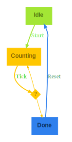

<!-- START doctoc generated TOC please keep comment here to allow auto update -->
<!-- DON'T EDIT THIS SECTION, INSTEAD RE-RUN doctoc TO UPDATE -->

- [purescript-transit](#purescript-transit)
  - [Features](#features)
  - [Documentation](#documentation)
  - [Installation](#installation)
  - [Minimal Example](#minimal-example)

<!-- END doctoc generated TOC please keep comment here to allow auto update -->

<picture>
  <source media="(prefers-color-scheme: dark)" srcset="assets/logo-dark.svg">
  <source media="(prefers-color-scheme: light)" srcset="assets/logo-light.svg">
  
</picture>

A library for building type-safe state machines.

# purescript-transit

## Features

- State Transitions are specified with **type level DSL**.
- **Compile time guarantees** that state update functions are complete and valid.
- Automatic **state diagram generation**
- State machine **graph analysis**
- Optimized for **speed**

## Documentation

- [API Reference](https://pursuit.purescript.org/packages/purescript-transit/docs/Transit)

<!--
- Tutorial
-->

## Installation

(once published to package set:)

```bash
spago install transit
```

## Minimal Example

> Full source code: _[test/Examples/CountDown.purs](test/Examples/CountDown.purs)_

Define the state and message as Variant types:

<!-- PD_START:purs
pick:
  - tag: any
    name: State
    filePath: test/Examples/CountDown.purs
  - tag: any
    name: Msg
    filePath: test/Examples/CountDown.purs
-->

```purescript
type State = Variant
  ( "Idle" :: {}
  , "Counting" :: { count :: Int }
  , "Done" :: {}
  )

type Msg = Variant
  ( "Start" :: { initialCount :: Int }
  , "Tick" :: {}
  , "Reset" :: {}
  )
```

<!-- PD_END -->

Define a state transitions with a type-level DSL:

<!-- PD_START:purs
pick:
  - tag: any
    name: CountDownTransit
    filePath: test/Examples/CountDown.purs
-->

```purescript
type CountDownTransit =
  Transit
    :* ("Idle" :@ "Start" >| "Counting")
    :* ("Done" :@ "Reset" >| "Idle")
    :*
      ( "Counting" :@ "Tick"
          >| "Counting"
          >| "Done"
      )
```

<!-- PD_END -->

Write update function that is checked at compile against the state machine specification:

<!-- PD_START:purs
pick:
  - tag: any
    name: update
    filePath: test/Examples/CountDown.purs
-->

```purescript
update :: State -> Msg -> State
update = mkUpdate @CountDownTransit
  ( match @"Idle" @"Start" \_ msg ->
      return @"Counting" { count: msg.initialCount }
  )
  ( match @"Done" @"Reset" \_ _ ->
      return @"Idle"
  )
  ( match @"Counting" @"Tick" \state _ ->
      let
        nextCount = state.count - 1
      in
        if nextCount == 0 then
          return @"Done"
        else
          return @"Counting" { count: nextCount }
  )
```

<!-- PD_END -->

Reflect type level state machine specification to a term level representation:

<!-- PD_START:purs
pick:
  - tag: any
    name: countDownTransit
    filePath: test/Examples/CountDown.purs
-->

```purescript
countDownTransit :: TransitCore
countDownTransit = reflectType (Proxy @CountDownTransit)
```

<!-- PD_END -->

Generate state diagram or perform other analysis on the state machine's runtime representation:

<!-- PD_START:purs
pick:
  - tag: any
    name: main
    filePath: test/Examples/CountDown.purs
-->

```purescript
main :: Effect Unit
main = do
  let
    graph :: String
    graph = TransitGraphviz.generate_ countDownTransit

  FS.writeTextFile UTF8 "renders/count-down.dot" graph
```

<!-- PD_END -->

The result will look like:


