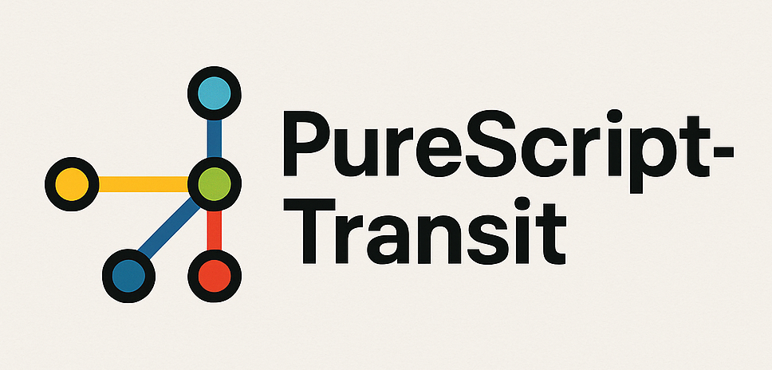
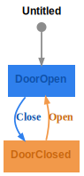
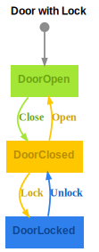
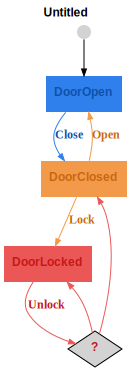
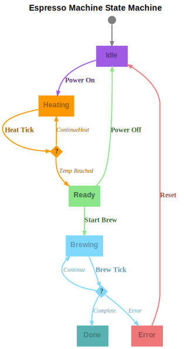
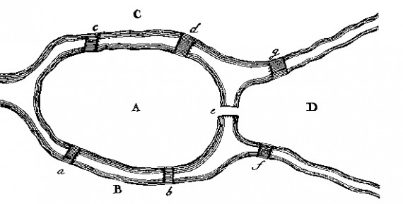

<picture>
  <source media="(prefers-color-scheme: dark)" srcset="assets/logo-dark.png">
  <source media="(prefers-color-scheme: light)" srcset="assets/logo-light.png">
  
</picture>

Type-Safe State Machines.

<!-- START doctoc generated TOC please keep comment here to allow auto update -->
<!-- DON'T EDIT THIS SECTION, INSTEAD RE-RUN doctoc TO UPDATE -->

- [Transit](#transit)
  - [Installation](#installation)
  - [Example1: Door](#example1-door)
  - [Example2: Door with Lock](#example2-door-with-lock)
  - [Generate State Diagrams](#generate-state-diagrams)
  - [Generate Transition Tables](#generate-transition-tables)
  - [Example3: Door with Pin](#example3-door-with-pin)
  - [Example4: Door with Pin and Alarm](#example4-door-with-pin-and-alarm)
  - [Type signatures in update functions](#type-signatures-in-update-functions)
  - [Example5: Espresso Machine](#example5-espresso-machine)
  - [Tests](#tests)
  - [Monadic update functions](#monadic-update-functions)
  - [Example 6: Seven Bridges of Königsberg](#example-6-seven-bridges-of-k%C3%B6nigsberg)
  - [Example 7: das-ist-das-haus-vom-ni-ko-laus](#example-7-das-ist-das-haus-vom-ni-ko-laus)
  - [Colors](#colors)

<!-- END doctoc generated TOC please keep comment here to allow auto update -->

# Transit

## Installation

```bash
spago install transit
```

## Example1: Door

Let's have a look at the following state diagram:



It has two states (`DoorOpen` and `DoorClosed`) and two messages (`Close` and `Open`). Initial state is `DoorOpen` indicated by the grey arrow pointing to it.
Another way to represent this is a transition table:

<!-- PD_START:raw
filePath: graphs/door.html
--><table >
<caption style="text-align: left; font-weight: bold;">
Transition Table
</caption>
<thead >
<tr >
<th >
From State
</th>
<th >

</th>
<th >
Message
</th>
<th >

</th>
<th >
To State
</th>
</tr>
</thead>
<tbody >
<tr >
<td >
DoorOpen
</td>
<td >
⟶
</td>
<td >
Close
</td>
<td >
⟶
</td>
<td >
DoorClosed
</td>
</tr>
<tr >
<td >
DoorClosed
</td>
<td >
⟶
</td>
<td >
Open
</td>
<td >
⟶
</td>
<td >
DoorOpen
</td>
</tr>
</tbody>
</table><!-- PD_END -->

In PureScript types, we can represent the states and messages of the state machine with the following data types:

<!-- PD_START:purs
filePath: test/Test/Examples/Door.purs
pick:
  - State
  - Msg
-->

```purescript
data State = DoorOpen | DoorClosed

data Msg = Close | Open
```

<!-- PD_END -->

The classic approach to implement the state transitions in pure functional programming is to write an update function that takes a state and a message and returns a new state. For example:

<!-- PD_START:purs
filePath: test/Test/Examples/Door.purs
pick:
  - updateClassic
-->

```purescript
updateClassic :: State -> Msg -> State
updateClassic state msg = case state, msg of
  DoorOpen, Close -> DoorClosed
  DoorClosed, Open -> DoorOpen
  _, _ -> state
```

<!-- PD_END -->

The state diagram shows clearly the characteristics of the state machine. E.g. we see right away that the door can be opened and closed infinitely. In other words: There are no unwanted dead ends. Later we will see how to verify such properties with code.

Unfortunately the state diagram and the actual implementation can easily get out of sync.

With the transit library we take a slightly different approach. We define first a type level specification of the state machine. It looks like this:

<!-- PD_START:purs
filePath: test/Test/Examples/Door.purs
pick:
  - DoorDSL
-->

```purescript
type DoorDSL =
  Wrap $ Empty
    :* ("DoorOpen" :@ "Close" >| "DoorClosed")
    :* ("DoorClosed" :@ "Open" >| "DoorOpen")
```

<!-- PD_END -->

This fully specifies the state machine. Based on this spec we can now an update function which only allows implementations legal state transitions. For example:

<!-- PD_END -->

<!-- PD_START:purs
filePath: test/Test/Examples/Door.purs
pick:
  - update
-->

```purescript
update :: State -> Msg -> State
update = mkUpdateGeneric @DoorDSL
  (match @"DoorOpen" @"Close" \_ _ -> return' @"DoorClosed")
  (match @"DoorClosed" @"Open" \_ _ -> return' @"DoorOpen")
```

<!-- PD_END -->

As you can see the type of the update function is exactly the same as the type of the update function we wrote in the classic approach. The most interesting part here is what would _not_ compile:

- Missing a match line for a state transition
- Returning illegal states
- Missing names of states and messages

Indeed this is the only possible implementation of this particular state machine. Like for example there is only one possible way to implement the identity function.
Later we see how to generate the state diagram from the spec.

## Example2: Door with Lock



## Generate State Diagrams

<!-- PD_START:purs
filePath: test/Test/Examples/Door.purs
pick:
  - main
-->

```purescript
main :: Effect Unit
main = do
  let
    g = reflectType (Proxy @DoorDSL)
  TransitGraphviz.writeToFile_ g "graphs/door.dot"
  TransitTable.writeToFile_ g "graphs/door.html"
```

<!-- PD_END -->

## Generate Transition Tables

## Example3: Door with Pin



## Example4: Door with Pin and Alarm


## Type signatures in update functions

## Example5: Espresso Machine



## Tests

We can be much more confident now that the state machine is correct.

We can even go one step further and write tests to verify certain properties of the state machine. For example we can verify that there are no dead ends in the state machine:

<!-- PD_START:purs
filePath: test/Test/Examples/Door.purs
pick:
  - spec
-->

```purescript
spec :: Spec Unit
spec = do
  pure unit
```

<!-- PD_END -->

## Monadic update functions

## Example 6: Seven Bridges of Königsberg



<!-- PD_START:purs
filePath: test/Test/Examples/BridgesKoenigsberg.purs
pick:
  - State
  - Msg
-->

```purescript
data State = LandA | LandB | LandC | LandD

data Msg
  = CrossBridge_a
  | CrossBridge_b
  | CrossBridge_c
  | CrossBridge_d
  | CrossBridge_e
  | CrossBridge_f
  | CrossBridge_g
```

<!-- PD_END -->

<!-- PD_START:raw
filePath: graphs/bridges-koenigsberg.html
--><table >
<caption style="text-align: left; font-weight: bold;">
Transition Table
</caption>
<thead >
<tr >
<th >
From State
</th>
<th >

</th>
<th >
Message
</th>
<th >

</th>
<th >
To State
</th>
</tr>
</thead>
<tbody >
<tr >
<td >
LandA
</td>
<td >
⟶
</td>
<td >
CrossBridge_a
</td>
<td >
⟶
</td>
<td >
LandB
</td>
</tr>
<tr >
<td >
LandA
</td>
<td >
⟶
</td>
<td >
CrossBridge_b
</td>
<td >
⟶
</td>
<td >
LandB
</td>
</tr>
<tr >
<td >
LandA
</td>
<td >
⟶
</td>
<td >
CrossBridge_c
</td>
<td >
⟶
</td>
<td >
LandC
</td>
</tr>
<tr >
<td >
LandA
</td>
<td >
⟶
</td>
<td >
CrossBridge_d
</td>
<td >
⟶
</td>
<td >
LandC
</td>
</tr>
<tr >
<td >
LandA
</td>
<td >
⟶
</td>
<td >
CrossBridge_e
</td>
<td >
⟶
</td>
<td >
LandD
</td>
</tr>
<tr >
<td >
LandB
</td>
<td >
⟶
</td>
<td >
CrossBridge_a
</td>
<td >
⟶
</td>
<td >
LandA
</td>
</tr>
<tr >
<td >
LandB
</td>
<td >
⟶
</td>
<td >
CrossBridge_b
</td>
<td >
⟶
</td>
<td >
LandA
</td>
</tr>
<tr >
<td >
LandB
</td>
<td >
⟶
</td>
<td >
CrossBridge_f
</td>
<td >
⟶
</td>
<td >
LandD
</td>
</tr>
<tr >
<td >
LandC
</td>
<td >
⟶
</td>
<td >
CrossBridge_c
</td>
<td >
⟶
</td>
<td >
LandA
</td>
</tr>
<tr >
<td >
LandC
</td>
<td >
⟶
</td>
<td >
CrossBridge_d
</td>
<td >
⟶
</td>
<td >
LandA
</td>
</tr>
<tr >
<td >
LandC
</td>
<td >
⟶
</td>
<td >
CrossBridge_g
</td>
<td >
⟶
</td>
<td >
LandD
</td>
</tr>
<tr >
<td >
LandD
</td>
<td >
⟶
</td>
<td >
CrossBridge_e
</td>
<td >
⟶
</td>
<td >
LandA
</td>
</tr>
<tr >
<td >
LandD
</td>
<td >
⟶
</td>
<td >
CrossBridge_f
</td>
<td >
⟶
</td>
<td >
LandB
</td>
</tr>
<tr >
<td >
LandD
</td>
<td >
⟶
</td>
<td >
CrossBridge_g
</td>
<td >
⟶
</td>
<td >
LandC
</td>
</tr>
</tbody>
</table><!-- PD_END -->


## Example 7: das-ist-das-haus-vom-ni-ko-laus


## Colors

---

```purescript


type Temperature = Number
type WaterLevel = Number

data State
  = Idle
  | Heating { targetTemp :: Temperature }
  | Ready   { waterLevel :: WaterLevel, temp :: Temperature }
  | Brewing { seconds :: Int }
  | Error { message :: String }
  | Done


data Msg
  = PowerOn { targetTemp :: Temperature }
  | TempReached { temp :: Temperature }
  | StartBrew { pumpOK :: Boolean, waterLevel :: WaterLevel }
  | BrewTick { deltaSeconds :: Int }   -- <— new
  | BrewComplete
  | SensorErrorDetected { message :: String }
  | RefillDone { waterAdded :: WaterLevel }
  | PowerOff
  | Reset


```
