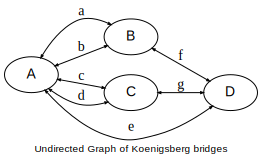
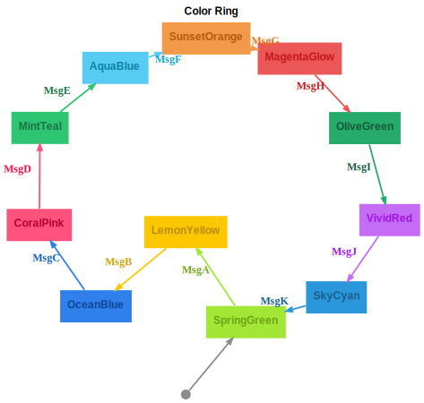

<picture>
  <source media="(prefers-color-scheme: dark)" srcset="assets/logo-dark.png">
  <source media="(prefers-color-scheme: light)" srcset="assets/logo-light.png">
  
</picture>

Type-Safe State Machines.

<!-- START doctoc generated TOC please keep comment here to allow auto update -->
<!-- DON'T EDIT THIS SECTION, INSTEAD RE-RUN doctoc TO UPDATE -->

- [Transit](#transit)
  - [Installation](#installation)
  - [Example1: Door](#example1-door)
    - [The Classic Approach](#the-classic-approach)
    - [The Transit Approach](#the-transit-approach)
    - [Compile-Time Safety](#compile-time-safety)
  - [Example2: Door with Lock](#example2-door-with-lock)
    - [The Classic Approach](#the-classic-approach-1)
    - [The Transit Approach](#the-transit-approach-1)
  - [Generate State Diagrams](#generate-state-diagrams)
  - [Generate Transition Tables](#generate-transition-tables)
  - [Example3: Door with Pin](#example3-door-with-pin)
    - [The Classic Approach](#the-classic-approach-2)
    - [The Transit Approach](#the-transit-approach-2)
  - [Example4: Door with Pin and Alarm](#example4-door-with-pin-and-alarm)
  - [Type signatures in update functions](#type-signatures-in-update-functions)
  - [Example5: Espresso Machine](#example5-espresso-machine)
  - [Tests](#tests)
  - [Monadic update functions](#monadic-update-functions)
  - [Example 6: Seven Bridges of Königsberg](#example-6-seven-bridges-of-k%C3%B6nigsberg)
  - [Example 7: das-ist-das-haus-vom-ni-ko-laus](#example-7-das-ist-das-haus-vom-ni-ko-laus)
  - [Colors](#colors)

<!-- END doctoc generated TOC please keep comment here to allow auto update -->

# Transit

## Installation

```bash
spago install transit
```

## Example1: Door

Let's start with a simple door state machine. Here's its state diagram:


This state machine has two states (`DoorOpen` and `DoorClosed`) and two messages (`Close` and `Open`). The initial state is `DoorOpen`, indicated by the grey arrow pointing to it.

Another way to represent this is a transition table:

<!-- PD_START:raw
filePath: graphs/door.html
--><table><caption>Door</caption><thead><tr><th>From State</th><th /><th>Message</th><th /><th>To State</th></tr></thead><tbody><tr><td>DoorOpen</td><td>⟶</td><td>Close</td><td>⟶</td><td>DoorClosed</td></tr><tr><td>DoorClosed</td><td>⟶</td><td>Open</td><td>⟶</td><td>DoorOpen</td></tr></tbody></table><!-- PD_END -->

In PureScript, we represent the states and messages with simple data types:

<!-- PD_START:purs
filePath: test/Examples/Door.purs
pick:
  - State
  - Msg
-->

```purescript
data State = DoorOpen | DoorClosed

data Msg = Close | Open
```

<!-- PD_END -->

### The Classic Approach

The traditional way to implement state transitions is to write an update function that takes a state and a message and returns a new state:

<!-- PD_START:purs
filePath: test/Examples/Door.purs
pick:
  - updateClassic
-->

```purescript
updateClassic :: State -> Msg -> State
updateClassic state msg = case state, msg of
  DoorOpen, Close -> DoorClosed
  DoorClosed, Open -> DoorOpen
  _, _ -> state
```

<!-- PD_END -->

While this approach works, it has some drawbacks:

- The state diagram and implementation can easily get out of sync
- The compiler won't catch missing transitions or invalid state/message combinations
- You need to manually ensure all cases are handled correctly

### The Transit Approach

With the transit library, we take a different approach. First, we define a type-level specification of the state machine:

<!-- PD_START:purs
filePath: test/Examples/Door.purs
pick:
  - DoorDSL
-->

```purescript
type DoorDSL =
  Transit $ Empty
    :* ("DoorOpen" :@ "Close" >| "DoorClosed")
    :* ("DoorClosed" :@ "Open" >| "DoorOpen")
```

<!-- PD_END -->

This DSL syntax reads as: "From state `DoorOpen` on message `Close`, transition to state `DoorClosed`" and "From state `DoorClosed` on message `Open`, transition to state `DoorOpen`". The `Empty` starts the list, and `:*` adds each transition.

This type-level specification fully defines the state machine. Based on this spec, we can now create an update function that the compiler ensures only allows legal state transitions:

<!-- PD_START:purs
filePath: test/Examples/Door.purs
pick:
  - update
-->

```purescript
update :: State -> Msg -> State
update = mkUpdateGeneric @DoorDSL
  (match @"DoorOpen" @"Close" \_ _ -> return @"DoorClosed")
  (match @"DoorClosed" @"Open" \_ _ -> return @"DoorOpen")
```

<!-- PD_END -->

Notice that the type signature is identical to the classic approach—`State -> Msg -> State`. The difference is that the compiler now enforces correctness at compile time.

### Compile-Time Safety

The type system ensures that your implementation matches the specification. The following will **not** compile:

- 🔴 Missing a match line for a state transition
- 🔴 Matching on illegal state/message combinations
- 🔴 Returning illegal states
- 🔴 Misspelled names of states and messages

Conversely, the compiler guarantees:

- 🟢 All matches are covered
- 🟢 Each match is on the correct state/message combination
- 🟢 Each match returns the correct state
- 🟢 All symbols (type-level strings) are spelled correctly

Later we'll see how to generate the state diagram directly from the spec, ensuring it always stays in sync with the code.

## Example2: Door with Lock

Now let's extend our door example by adding a lock mechanism. Here's the enhanced state diagram:


This state machine extends the simple door with a third state (`DoorLocked`) and two additional messages (`Lock` and `Unlock`). Notice that you can only lock the door when it's closed, and unlocking returns you to the closed state (not open). This is a common pattern in real-world state machines where certain operations are only valid in specific states.

The transition table shows all valid transitions:

<!-- PD_START:raw
filePath: graphs/door-with-lock.html
--><table><caption>Door with Lock</caption><thead><tr><th>From State</th><th /><th>Message</th><th /><th>To State</th></tr></thead><tbody><tr><td>DoorOpen</td><td>⟶</td><td>Close</td><td>⟶</td><td>DoorClosed</td></tr><tr><td>DoorClosed</td><td>⟶</td><td>Lock</td><td>⟶</td><td>DoorLocked</td></tr><tr><td>DoorClosed</td><td>⟶</td><td>Open</td><td>⟶</td><td>DoorOpen</td></tr><tr><td>DoorLocked</td><td>⟶</td><td>Unlock</td><td>⟶</td><td>DoorClosed</td></tr></tbody></table><!-- PD_END -->

The PureScript types extend the previous example:

<!-- PD_START:purs
filePath: test/Examples/DoorWithLock.purs
pick:
  - State
  - Msg
-->

```purescript
data State
  = DoorOpen
  | DoorClosed
  | DoorLocked

data Msg
  = Close
  | Open
  | Lock
  | Unlock
```

<!-- PD_END -->

### The Classic Approach

The classic update function now handles more cases:

<!-- PD_START:purs
filePath: test/Examples/DoorWithLock.purs
pick:
  - updateClassic
-->

```purescript
updateClassic :: State -> Msg -> State
updateClassic state msg = case state, msg of
  DoorOpen, Close -> DoorClosed
  DoorClosed, Open -> DoorOpen
  DoorClosed, Lock -> DoorLocked
  DoorLocked, Unlock -> DoorClosed
  _, _ -> state
```

<!-- PD_END -->

As the state machine grows, the classic approach becomes more error-prone. You need to remember:

- Which messages are valid in which states
- What the next state should be for each transition
- To handle all edge cases (like trying to lock an open door)

### The Transit Approach

With transit, we extend the DSL specification to include the new transitions:

<!-- PD_START:purs
filePath: test/Examples/DoorWithLock.purs
pick:
  - DoorDSL
-->

```purescript
type DoorDSL =
  Transit $ Empty
    :* ("DoorOpen" :@ "Close" >| "DoorClosed")
    :* ("DoorClosed" :@ "Open" >| "DoorOpen")
    :* ("DoorClosed" :@ "Lock" >| "DoorLocked")
    :* ("DoorLocked" :@ "Unlock" >| "DoorClosed")
```

<!-- PD_END -->

The update function now includes all four transitions, and the compiler ensures each one is correctly implemented:

<!-- PD_START:purs
filePath: test/Examples/DoorWithLock.purs
pick:
  - update
-->

```purescript
update :: State -> Msg -> State
update = mkUpdateGeneric @DoorDSL
  (match @"DoorOpen" @"Close" \_ _ -> return @"DoorClosed")
  (match @"DoorClosed" @"Open" \_ _ -> return @"DoorOpen")
  (match @"DoorClosed" @"Lock" \_ _ -> return @"DoorLocked")
  (match @"DoorLocked" @"Unlock" \_ _ -> return @"DoorClosed")
```

<!-- PD_END -->

The type system prevents common mistakes:

- 🔴 Trying to match `DoorOpen` with `Lock` (invalid transition)
- 🔴 Returning `DoorOpen` from the `Unlock` handler (wrong target state)
- 🔴 Forgetting to handle the `Lock` transition

This becomes even more valuable as state machines grow in complexity.

## Generate State Diagrams

One of the key benefits of transit is that you can generate state diagrams directly from your type-level specification. This ensures your diagrams always stay in sync with your code—no manual updates required.

To generate a state diagram, you use `mkStateGraph` to create a graph from your DSL specification, then write it to a Graphviz `.dot` file:

<!-- PD_START:purs
filePath: test/Examples/GenerateStateDiagrams.purs
pick:
  - main
-->

```purescript
main :: Effect Unit
main = do
  let
    stateGraph = mkStateGraph (reflectType (Proxy @DoorDSL))

  TransitGraphviz.writeToFile (_ { title = "Door" }) stateGraph "graphs/door.dot"
```

<!-- PD_END -->

The process works in three steps:

1. `reflectType` converts your type-level DSL specification to a term-level equivalent
2. `mkStateGraph` transforms that into a general-purpose graph data structure
3. `TransitGraphviz.writeToFile` uses the graph data structure to render a Graphviz `.dot` file

This separation allows the same graph data structure to be used by different renderers (like the transition table generator).

To convert the `.dot` file to an SVG (or other formats), use the Graphviz command-line tools:

```bash
dot -Tsvg graphs/door.dot -o graphs/door.svg
```

Or for PNG:

```bash
dot -Tpng graphs/door.dot -o graphs/door.png
```

Since the diagram is generated from the same DSL specification used to create the type-safe update function, any changes to your state machine are automatically reflected in both the code and the diagram. This eliminates the common problem of documentation getting out of sync with implementation.

## Generate Transition Tables

In addition to state diagrams, you can also generate transition tables from the same graph data structure. This provides a tabular view of all state transitions, which can be easier to read for some use cases.

The process is identical to generating state diagrams—you use the same `mkStateGraph` function to create the graph, but then use `TransitTable.writeToFile` instead:

<!-- PD_START:purs
filePath: test/Examples/GenerateTransitionTables.purs
pick:
  - main
-->

```purescript
main :: Effect Unit
main = do
  let
    stateGraph = mkStateGraph (reflectType (Proxy @DoorDSL))

  TransitTable.writeToFile (_ { title = "Door" }) stateGraph "graphs/door.html"
```

<!-- PD_END -->

This generates an HTML file containing a table with columns for "From State", "Message", and "To State". The table can be embedded directly in documentation (as shown in the examples above) or viewed in a browser.

Since both the state diagram and transition table are generated from the same graph data structure, they're guaranteed to be consistent with each other and with your type-level specification.

## Example3: Door with Pin

Now let's add a PIN code to our door lock. This introduces two important concepts: **states with data** and **conditional transitions**.


In this example, the `DoorLocked` state stores a PIN code, and the `Unlock` message includes the entered PIN. The unlock operation can succeed (transitioning to `DoorClosed`) or fail (staying in `DoorLocked`), depending on whether the entered PIN matches the stored one.

Notice the diamond node in the state diagram—this represents a conditional transition where the outcome depends on runtime data.

The transition table shows both possible outcomes:

<!-- PD_START:raw
filePath: graphs/door-with-pin.html
--><table><caption>Door with Pin</caption><thead><tr><th>From State</th><th /><th>Message</th><th /><th>To State</th></tr></thead><tbody><tr><td>DoorOpen</td><td>⟶</td><td>Close</td><td>⟶</td><td>DoorClosed</td></tr><tr><td>DoorClosed</td><td>⟶</td><td>Lock</td><td>⟶</td><td>DoorLocked</td></tr><tr><td>DoorClosed</td><td>⟶</td><td>Open</td><td>⟶</td><td>DoorOpen</td></tr><tr><td>DoorLocked</td><td>⟶</td><td>Unlock</td><td>⟶</td><td>DoorClosed</td></tr><tr><td>DoorLocked</td><td>⟶</td><td>Unlock</td><td>⟶</td><td>DoorLocked</td></tr></tbody></table><!-- PD_END -->

The PureScript types now include data in both states and messages:

<!-- PD_START:purs
filePath: test/Examples/DoorWithPin.purs
pick:
  - State
  - Msg
-->

```purescript
data State
  = DoorOpen
  | DoorClosed
  | DoorLocked { pin :: String }

data Msg
  = Close
  | Open
  | Lock { newPin :: String }
  | Unlock { enteredPin :: String }
```

<!-- PD_END -->

### The Classic Approach

The classic update function now needs to handle state and message data:

<!-- PD_START:purs
filePath: test/Examples/DoorWithPin.purs
pick:
  - updateClassic
-->

```purescript
updateClassic :: State -> Msg -> State
updateClassic state msg = case state, msg of
  DoorOpen, Close -> DoorClosed
  DoorClosed, Open -> DoorOpen
  DoorClosed, Lock { newPin } -> DoorLocked { pin: newPin }
  DoorLocked { pin }, Unlock { enteredPin } ->
    if pin == enteredPin then
      DoorClosed
    else
      DoorLocked { pin }
  _, _ -> state
```

<!-- PD_END -->

### The Transit Approach

In the DSL specification, we express conditional transitions by listing multiple possible target states:

<!-- PD_START:purs
filePath: test/Examples/DoorWithPin.purs
pick:
  - DoorDSL
-->

```purescript
type DoorDSL =
  Transit $ Empty
    :* ("DoorOpen" :@ "Close" >| "DoorClosed")
    :* ("DoorClosed" :@ "Open" >| "DoorOpen")
    :* ("DoorClosed" :@ "Lock" >| "DoorLocked")
    :*
      ( "DoorLocked" :@ "Unlock"
          >| "DoorClosed"
          >| "DoorLocked"
      )
```

<!-- PD_END -->

The syntax `>| "DoorClosed" >| "DoorLocked"` indicates that the `Unlock` message from `DoorLocked` can transition to either state, depending on runtime conditions.

The update function now has access to both the current state and the message data, allowing you to implement the conditional logic:

<!-- PD_START:purs
filePath: test/Examples/DoorWithPin.purs
pick:
  - update
-->

```purescript
update :: State -> Msg -> State
update = mkUpdateGeneric @DoorDSL
  ( match @"DoorOpen" @"Close" \_ _ ->
      return @"DoorClosed"
  )
  ( match @"DoorClosed" @"Open" \_ _ ->
      return @"DoorOpen"
  )
  ( match @"DoorClosed" @"Lock" \_ msg ->
      return @"DoorLocked" { pin: msg.newPin }
  )
  ( match @"DoorLocked" @"Unlock" \state msg ->
      if state.pin == msg.enteredPin then
        return @"DoorClosed"
      else
        return @"DoorLocked" { pin: state.pin }
  )
```

<!-- PD_END -->

The match handlers receive both the current state and the message, giving you access to all the data needed to make runtime decisions. The type system still ensures that:

- 🔴 You can only return states that are valid targets for that transition
- 🔴 You handle all required transitions
- 🟢 The conditional logic is type-safe

## Example4: Door with Pin and Alarm


## Type signatures in update functions

## Example5: Espresso Machine


## Tests

We can be much more confident now that the state machine is correct.

We can even go one step further and write tests to verify certain properties of the state machine. For example we can verify that there are no dead ends in the state machine:

<!-- PD_START:purs
filePath: test/Examples/Door.purs
pick:
  - spec
-->

```purescript
spec :: Spec Unit
spec = do
  pure unit
```

<!-- PD_END -->

## Monadic update functions

## Example 6: Seven Bridges of Königsberg




<!-- PD_START:purs
filePath: test/Examples/BridgesKoenigsberg.purs
pick:
  - State
  - Msg
-->

```purescript
data State = LandA | LandB | LandC | LandD

data Msg
  = CrossBridge_a
  | CrossBridge_b
  | CrossBridge_c
  | CrossBridge_d
  | CrossBridge_e
  | CrossBridge_f
  | CrossBridge_g
```

<!-- PD_END -->

<!-- PD_START:raw
filePath: graphs/bridges-koenigsberg.html
--><table><caption>Untitled</caption><thead><tr><th>From State</th><th /><th>Message</th><th /><th>To State</th></tr></thead><tbody><tr><td>LandA</td><td>⟶</td><td>CrossBridge_a</td><td>⟶</td><td>LandB</td></tr><tr><td>LandB</td><td>⟶</td><td>CrossBridge_a</td><td>⟶</td><td>LandA</td></tr><tr><td>LandA</td><td>⟶</td><td>CrossBridge_b</td><td>⟶</td><td>LandB</td></tr><tr><td>LandB</td><td>⟶</td><td>CrossBridge_b</td><td>⟶</td><td>LandA</td></tr><tr><td>LandA</td><td>⟶</td><td>CrossBridge_c</td><td>⟶</td><td>LandC</td></tr><tr><td>LandC</td><td>⟶</td><td>CrossBridge_c</td><td>⟶</td><td>LandA</td></tr><tr><td>LandA</td><td>⟶</td><td>CrossBridge_d</td><td>⟶</td><td>LandC</td></tr><tr><td>LandC</td><td>⟶</td><td>CrossBridge_d</td><td>⟶</td><td>LandA</td></tr><tr><td>LandA</td><td>⟶</td><td>CrossBridge_e</td><td>⟶</td><td>LandD</td></tr><tr><td>LandD</td><td>⟶</td><td>CrossBridge_e</td><td>⟶</td><td>LandA</td></tr><tr><td>LandB</td><td>⟶</td><td>CrossBridge_f</td><td>⟶</td><td>LandD</td></tr><tr><td>LandD</td><td>⟶</td><td>CrossBridge_f</td><td>⟶</td><td>LandB</td></tr><tr><td>LandC</td><td>⟶</td><td>CrossBridge_g</td><td>⟶</td><td>LandD</td></tr><tr><td>LandD</td><td>⟶</td><td>CrossBridge_g</td><td>⟶</td><td>LandC</td></tr></tbody></table><!-- PD_END -->


## Example 7: das-ist-das-haus-vom-ni-ko-laus


## Colors



---

```purescript


type Temperature = Number
type WaterLevel = Number

data State
  = Idle
  | Heating { targetTemp :: Temperature }
  | Ready   { waterLevel :: WaterLevel, temp :: Temperature }
  | Brewing { seconds :: Int }
  | Error { message :: String }
  | Done


data Msg
  = PowerOn { targetTemp :: Temperature }
  | TempReached { temp :: Temperature }
  | StartBrew { pumpOK :: Boolean, waterLevel :: WaterLevel }
  | BrewTick { deltaSeconds :: Int }   -- <— new
  | BrewComplete
  | SensorErrorDetected { message :: String }
  | RefillDone { waterAdded :: WaterLevel }
  | PowerOff
  | Reset


```
