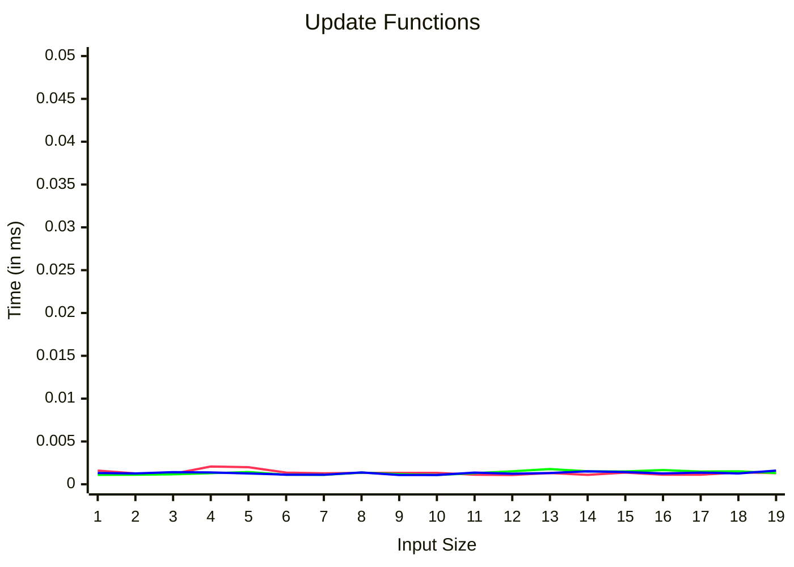

```mermaid
---
  config:
    themeVariables:
        xyChart:
            plotColorPalette: "#ff3456, #00ff00, #0000ff, #ffff00, #ff00ff, #00ffff"
---
xychart
  title "Update Functions"
  x-axis "Input Size" [1, 2, 3, 4, 5, 6, 7, 8, 9, 10, 11, 12, 13, 14, 15, 16, 17, 18, 19]
  y-axis "Time (in ms)" 0 --> 0.05
  line [0.0016, 0.00126, 0.00122, 0.00207, 0.00199, 0.00136, 0.00128, 0.00133, 0.00134, 0.00134, 0.00112, 0.00109, 0.00131, 0.0011, 0.00137, 0.00112, 0.00111, 0.00139, 0.00129]
  line [0.0011, 0.00111, 0.00117, 0.00129, 0.00144, 0.00111, 0.0011, 0.00137, 0.00119, 0.00109, 0.0013, 0.00151, 0.00178, 0.00151, 0.0015, 0.00166, 0.00149, 0.00152, 0.00131]
  line [0.00132, 0.00127, 0.00142, 0.00138, 0.00127, 0.00112, 0.00111, 0.00138, 0.00109, 0.00109, 0.00137, 0.00123, 0.00131, 0.00152, 0.00143, 0.00126, 0.00137, 0.00127, 0.0016]
```
 update (Transit with ADTs)&nbsp;&nbsp; updateClassic&nbsp;&nbsp; updateV (Transit with Variants)