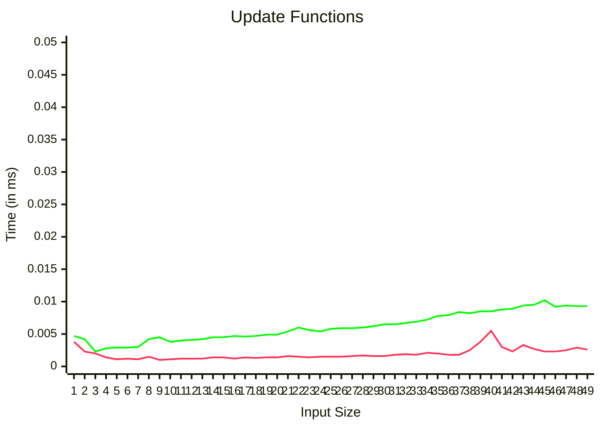

```mermaid
---
  config:
    themeVariables:
        xyChart:
            plotColorPalette: "#ff3456, #00ff00, #0000ff, #ffff00, #ff00ff, #00ffff"
---
xychart
  title "Update Functions"
  x-axis "Input Size" [1, 2, 3, 4, 5, 6, 7, 8, 9, 10, 11, 12, 13, 14, 15, 16, 17, 18, 19, 20, 21, 22, 23, 24, 25, 26, 27, 28, 29, 30, 31, 32, 33, 34, 35, 36, 37, 38, 39, 40, 41, 42, 43, 44, 45, 46, 47, 48, 49]
  y-axis "Time (in ms)" 0 --> 0.05
  line [0.0038, 0.0023, 0.002, 0.0014, 0.0011, 0.0012, 0.0011, 0.0015, 0.001, 0.0011, 0.0012, 0.0012, 0.0012, 0.0014, 0.0014, 0.0012, 0.0014, 0.0013, 0.0014, 0.0014, 0.0016, 0.0015, 0.0014, 0.0015, 0.0015, 0.0015, 0.0016, 0.0017, 0.0016, 0.0016, 0.0018, 0.0019, 0.0018, 0.0021, 0.002, 0.0018, 0.0018, 0.0025, 0.0038, 0.0055, 0.003, 0.0023, 0.0033, 0.0027, 0.0023, 0.0023, 0.0025, 0.0029, 0.0026]
  line [0.0047, 0.0042, 0.0023, 0.0028, 0.0029, 0.0029, 0.003, 0.0042, 0.0045, 0.0038, 0.004, 0.0041, 0.0042, 0.0045, 0.0045, 0.0047, 0.0046, 0.0047, 0.0049, 0.0049, 0.0054, 0.006, 0.0056, 0.0054, 0.0058, 0.0059, 0.0059, 0.006, 0.0062, 0.0065, 0.0065, 0.0067, 0.0069, 0.0072, 0.0078, 0.0079, 0.0084, 0.0082, 0.0085, 0.0085, 0.0088, 0.0089, 0.0094, 0.0095, 0.0102, 0.0092, 0.0094, 0.0093, 0.0093]
```
 updateClassic&nbsp;&nbsp; update