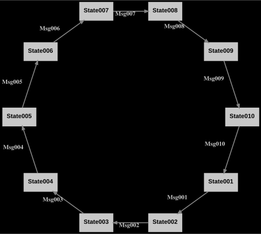
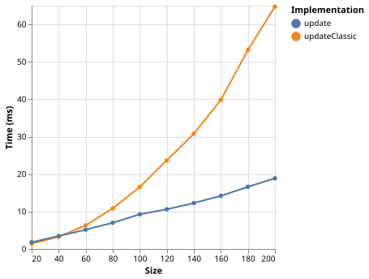
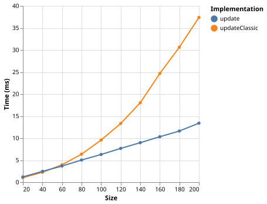
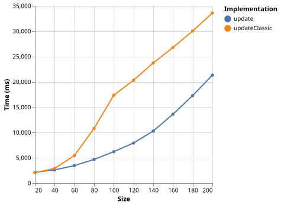

# Benchmarks

For the benchmarks state machines of different sizes have been generated.

For instance, a state machine of size 10 has 10 states and 10 transitions connecting the states in a circle.

In each benchmark the approach of the **Transit** library has been compared to classic approaches implementing the same state machine.

**Circle State Machine of Size=10**

## Runtime Benchmarks

For the runtime benchmarks, it was measured how long it takes to perform a full round trip through the state machine. Both the standard JS compiler backend and the optimized [ES backend](https://github.com/aristanetworks/purescript-backend-optimizer) have been tested.

The benchmarking tool used is [m-bock/purescript-benchlib](https://github.com/m-bock/purescript-benchlib).

### Standard JS Backend

We can clearly see that the **Transit** approach performs faster than the classic approach. More importantly, the performance of the **Transit** approach has linear growth with the size of the state machine.

### Optimized ES Backend

The optimized ES backend shows similar characteristics as the standard JS backend. However, both the **Transit** approach and the classic approach are roughly 2 times faster than with the standard JS backend.

## Compile Time Benchmarks

Since the **Transit** library leverages a lot of compile-time code, compilation times have also been measured. The diagram shows how long it takes to compile a PureScript module containing the whole implementation of a state machine of a given size.

The interpretation of the results is less clear here. However, it is evident that up to fairly large state machines (size=200), compilation times of the **Transit** approach are much faster than with the classic approach.

Compiler version 0.15.15 was used for the benchmarks.
